<div align="center">


### Encrypted. Private. Yours.

A privacy-first secure messenger for iOS and Android.


</div>

---

## The one rule

**The server never holds a key that can open a message.**

It routes sealed envelopes and stores ciphertext. Everything else — the design,
the API, the database schema — follows from that. Where a decision traded
convenience for keeping the server ignorant, that was deliberate.

No phone number. No email. No address-book upload. You are a username.

---

## The app

<table>
<tr>
<td align="center" width="25%"><br><sub><b>Welcome</b><br>What Privio promises, before anything is asked of you</sub></td>
<td align="center" width="25%"><br><sub><b>Chats</b><br>Search and filters run on-device</sub></td>
<td align="center" width="25%"><br><sub><b>Chat</b><br>Sealed before it leaves the phone</sub></td>
<td align="center" width="25%"><br><sub><b>Contacts</b><br>Usernames, not phone numbers</sub></td>
</tr>
<tr>
<td align="center"><br><sub><b>Account</b><br>Your identity, your storage, your keys</sub></td>
<td align="center"><br><sub><b>Invite</b><br>QR generated on-device</sub></td>
<td align="center"><br><sub><b>Settings</b><br>Everything in one place</sub></td>
<td align="center"><br><sub><b>Privacy &amp; Security</b><br>Every switch is enforced somewhere real</sub></td>
</tr>
<tr>
<td align="center"><br><sub><b>Devices</b><br>See what is logged in, log it out</sub></td>
<td align="center"><br><sub><b>Backup</b><br>Sealed with a key only you hold — and honest when there is none</sub></td>
<td align="center"><br><sub><b>Notifications</b><br>Only the delivery path is Privio's to decide — the rest is your phone's</sub></td>
<td align="center"><br><sub><b>Groups</b><br>The name is decrypted by members, never by the server</sub></td>
</tr>
<tr>
<td align="center"><br><sub><b>Channels</b><br>What you follow, and what there is to find</sub></td>
<td align="center"><br><sub><b>Channel feed</b><br>Posts sealed once, under a key the server never sees</sub></td>
<td align="center"><br><sub><b>Discover</b><br>Public channels only — private ones are never listed</sub></td>
<td align="center"><br><sub><b>Permissions</b><br>Greyed out is what you do not hold yourself</sub></td>
</tr>
<tr>
<td align="center"><br><sub><b>Recording</b><br>Hold the mic, slide left to cancel, pause any time</sub></td>
<td align="center"><br><sub><b>Preview</b><br>Listen back, or delete it — nothing is sent unheard</sub></td>
<td align="center"><br><sub><b>Voice message</b><br>Waveform and length come from the sealed payload</sub></td>
<td align="center"><br><sub><b>Playing</b><br>Decrypted in memory, 1x · 1.5x · 2x</sub></td>
</tr>
</table>

<details>
<summary><b>More screens</b> — add contact, invite link, new channel, members, appearance, about</summary>
<br>
<table>
<tr>
<td align="center" width="25%"><br><sub><b>Add contact</b></sub></td>
<td align="center" width="25%"><br><sub><b>Invite link</b></sub></td>
<td align="center" width="25%"><br><sub><b>New channel</b></sub></td>
<td align="center" width="25%"><br><sub><b>Channel members</b></sub></td>
</tr>
<tr>
<td align="center"><br><sub><b>After a promotion</b></sub></td>
<td align="center"><br><sub><b>Appearance</b><br>Text size, and nothing that only looks settable</sub></td>
<td align="center"><br><sub><b>About</b></sub></td>
<td align="center"></td>
</tr>
</table>
</details>

> These are real screenshots of the running app, captured at 390×844, not mockups.

### It actually works

Two accounts, two devices, one real server. Clara adds Finn by username, sends a
message, Finn's client decrypts it, replies, and Clara's client decrypts the
reply — the Double Ratchet running in both directions.

<table>
<tr>
<td align="center" width="25%"><br><sub><b>1.</b> Clara sends. The server takes bytes it cannot read.</sub></td>
<td align="center" width="25%"><br><sub><b>2.</b> It arrives at Finn, who had never heard of Clara.</sub></td>
<td align="center" width="25%"><br><sub><b>3.</b> His reply comes back decrypted.</sub></td>
<td align="center" width="25%"><br><sub><b>4.</b> After a relaunch it is still there — read back from the encrypted archive, not re-fetched.</sub></td>
</tr>
</table>

That run found a real bug: the client was declaring a JSON content type on
requests with no body, which a strict server rejects — so the receive loop had
been failing silently every three seconds. It is fixed and covered by a test.

### Ticks that mean what they say

The tick marks used to claim every message had been read — the model's default
said so, and nothing ever measured it. Now a message is sent, then delivered
when the other device has actually decrypted it, then read when the chat is
actually opened. Receipts are sealed envelopes like any other; the server sees
that something was sent and nothing else.

<table>
<tr>
<td align="center" width="33%"><br><sub><b>1.</b> Delivered: their device decrypted it. Two grey ticks.</sub></td>
<td align="center" width="33%"><br><sub><b>2.</b> Read: they opened the chat. Two green ticks.</sub></td>
<td align="center" width="33%"><br><sub><b>3.</b> Typing, which expires on its own — nothing arrives to say "stopped".</sub></td>
</tr>
</table>

The switches are reciprocal: turning read receipts off stops this device sending
them **and** showing other people's. A setting that took without giving would be
a different feature wearing this one's name.

### Replies and reactions

Hold a message. Six emoji and a Reply, and both go out the same way everything
else does: sealed for each of the recipient's devices, over the Signal session
that chat already has.

<table>
<tr>
<td align="center" width="25%">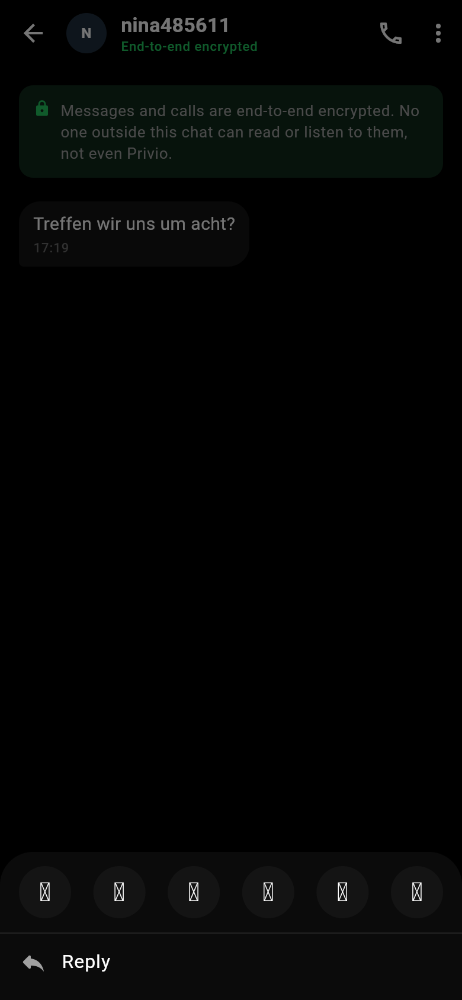<br><sub><b>1.</b> Hold a message: quick reactions and Reply.</sub></td>
<td align="center" width="25%">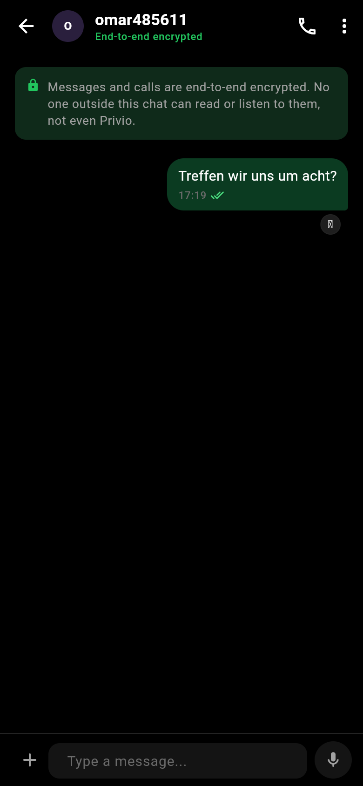<br><sub><b>2.</b> The reaction reaches the other device and sits under the bubble.</sub></td>
<td align="center" width="25%">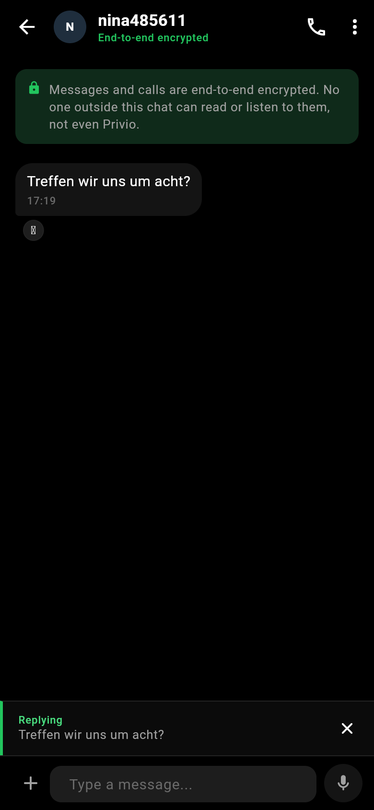<br><sub><b>3.</b> Replying: the quote is shown while it is being written.</sub></td>
<td align="center" width="25%">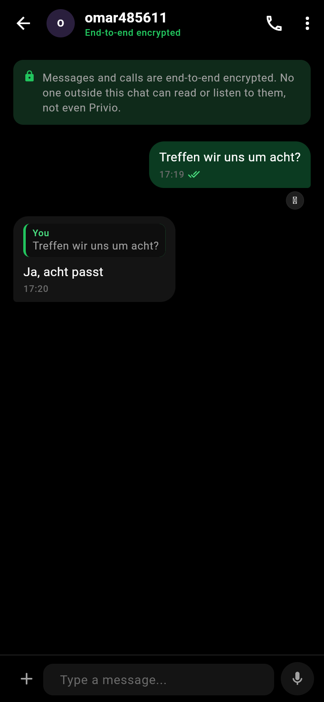<br><sub><b>4.</b> It arrives quoted — attributed correctly on both sides.</sub></td>
</tr>
</table>

A reply carries its own copy of the quoted line rather than a pointer the
server could resolve, so quoting works even where the other device has since
deleted the original, and the server learns nothing about which message was
answered. A reaction is one emoji per person per message: sending a different
one replaces it, sending the same one again clears it. A reaction to a message
this device does not have is dropped rather than invented — an empty bubble
with a heart on it would be a message the server made up.

### Settings that measured nothing

The Privacy & Security screen used to state "Two-Factor Authentication: On" and
"Blocked Users: 3" from constants in the widget tree, over accounts that had
neither. Both are now read from the server — and both now have the screen the
server had been waiting for since the endpoints were written.

<table>
<tr>
<td align="center" width="25%">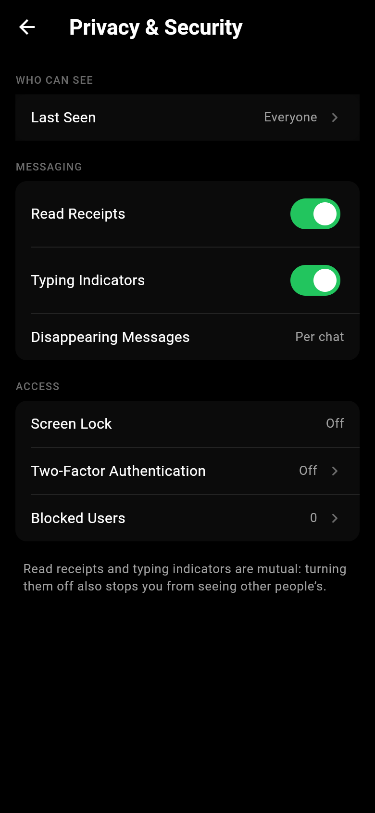<br><sub><b>1.</b> Every row read from somewhere. Rows nothing could back are gone.</sub></td>
<td align="center" width="25%">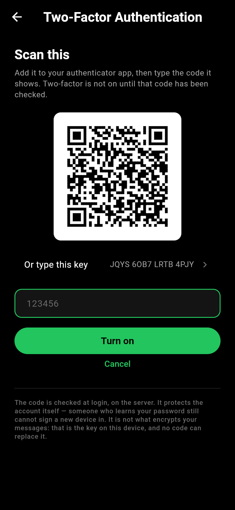<br><sub><b>2.</b> The QR is drawn on the device; the secret is never sent anywhere to be rendered.</sub></td>
<td align="center" width="25%">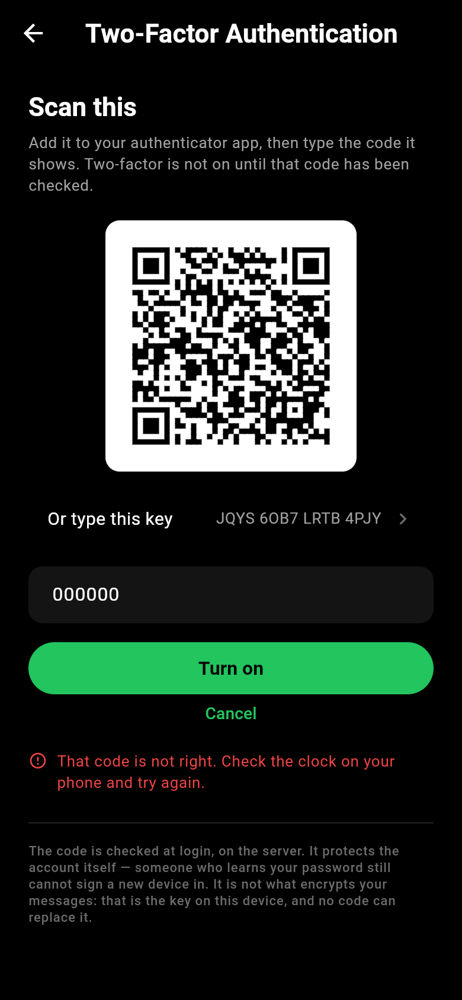<br><sub><b>3.</b> A wrong code changes nothing — the factor is not on until one is proved.</sub></td>
<td align="center" width="25%">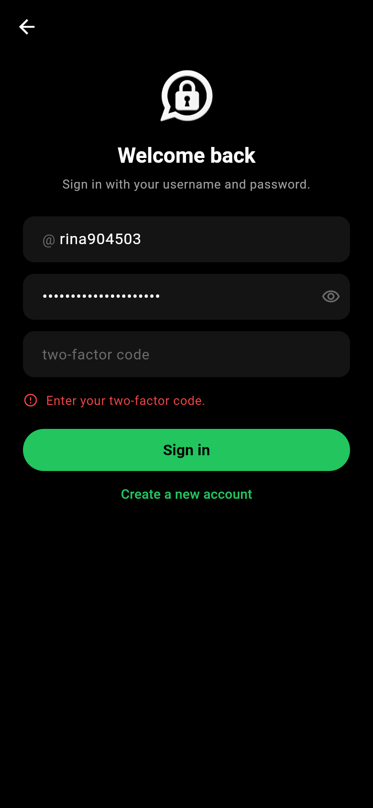<br><sub><b>4.</b> And then the login wants it.</sub></td>
</tr>
</table>

Enabling two-factor is two steps on purpose: the server issues a secret, and
the factor only comes into force once a code from it has been checked. A factor
switched on without that proof locks out the person who set it up. Turning it
off asks for the password, because an unlocked phone should not be enough.

That run also found a bug with nothing to do with two-factor. The whole account
plugin sat behind the login rate limit — ten requests per address per five
minutes — so reading your own account counted against the budget for guessing
your password. Opening a settings screen a few times could lock someone out of
their own account. The tight budget now belongs to the routes that actually
check a credential, and there is a test that runs against the real limit rather
than the relaxed one the rest of the suite uses.

### A code that destroys instead of opening

The duress code has been in the schema since the first migration and enforced at
login ever since: type it instead of your password and the account is
destroyed, while whoever is watching sees the same refusal a typo gets. Until
now the only way to arm it was a curl command — the one feature written for
someone being forced to hand over a phone, and it needed a terminal.

<table>
<tr>
<td align="center" width="25%">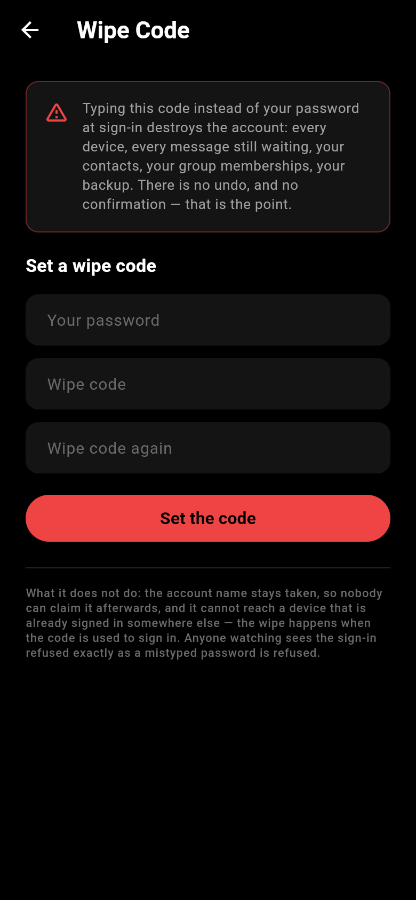<br><sub><b>1.</b> What it destroys, said plainly, before anything is typed.</sub></td>
<td align="center" width="25%">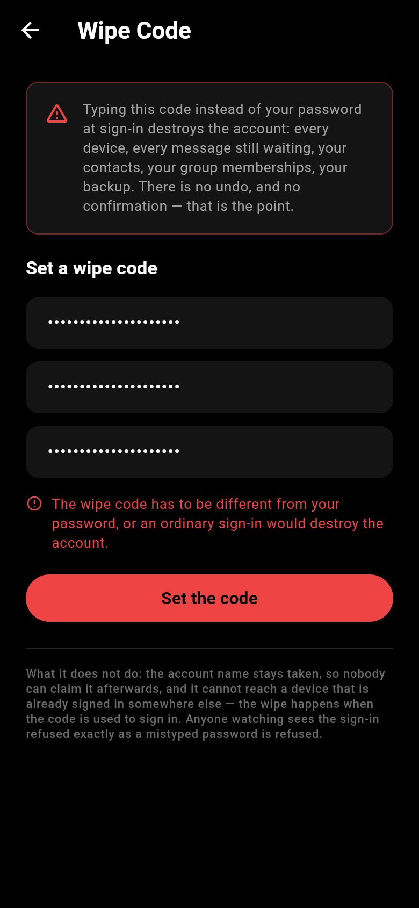<br><sub><b>2.</b> The code may not be the password — an ordinary sign-in would fire it.</sub></td>
<td align="center" width="25%">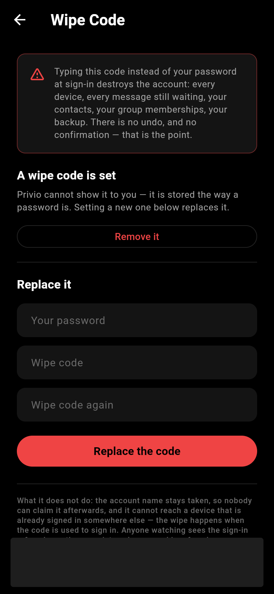<br><sub><b>3.</b> Armed. Privio cannot show it back to you; it is stored like a password.</sub></td>
<td align="center" width="25%">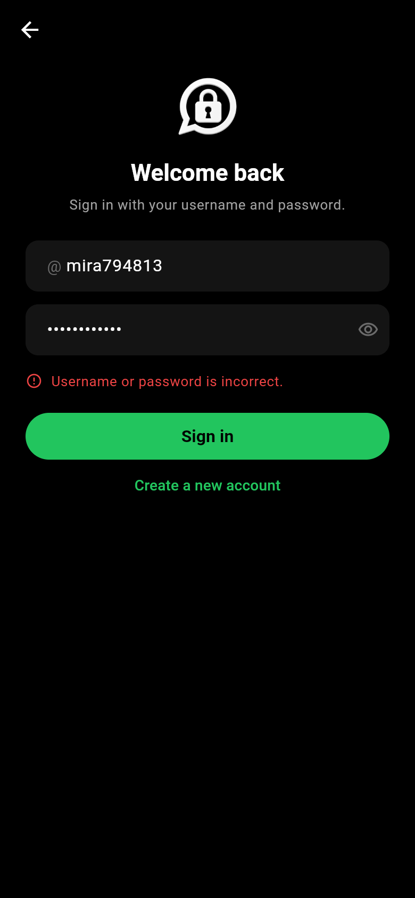<br><sub><b>4.</b> Used at sign-in: refused as "username or password is incorrect", and the account is gone.</sub></td>
</tr>
</table>

The browser run measured the wipe rather than trusting the message: one device
before the duress sign-in, zero after, the account row still present so the
username cannot be claimed by anyone else, and the duress code itself cleared.

### The last screens that made things up

Two screens were still rendering `DemoData`. One of them was **Devices** — the
screen whose entire job is answering "is anyone else signed in to my account" —
and it answered with an iPhone 15 Pro, a MacBook Pro, an iPad Pro and a Windows
PC that did not exist. The other was **Calls**, with five invented entries under
a comment claiming "the list is real".

<table>
<tr>
<td align="center" width="33%"><br><sub><b>1.</b> The devices actually signed in, from the server.</sub></td>
<td align="center" width="33%">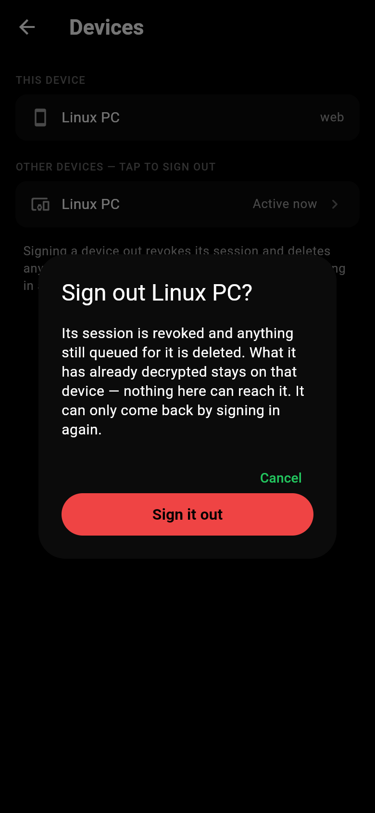<br><sub><b>2.</b> Signing one out says what that does, and what it cannot undo.</sub></td>
<td align="center" width="33%">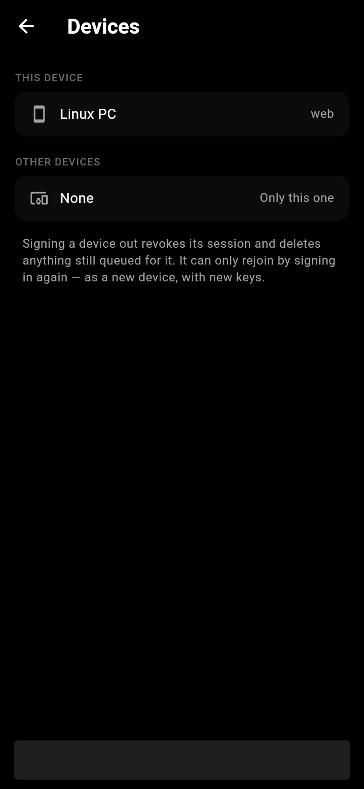<br><sub><b>3.</b> Gone — session revoked, queue deleted, and the list says so.</sub></td>
</tr>
</table>

The endpoints had been there since the first week. The browser run signed one
account in on two devices, watched both appear, signed one out, and confirmed
against the database that it went from two to one. `DemoData` is deleted, along
with the two model classes that were shaped for it — a call whose `timestamp`
was the string "Yesterday", a device whose `lastActive` was "Last active: 2h
ago". Nothing in the app renders invented data now.

### The lock screen the app could never reach

`AppStage.locked` and the PIN pad were built early, and nothing in the app ever
called `setPin` — so the lock could not be switched on, and the screen guarding
the on-device history was unreachable. It has a screen now, and with it the
duress code reaches the place a phone is actually taken: already signed in,
locked, with someone asking for the PIN.

<table>
<tr>
<td align="center" width="25%">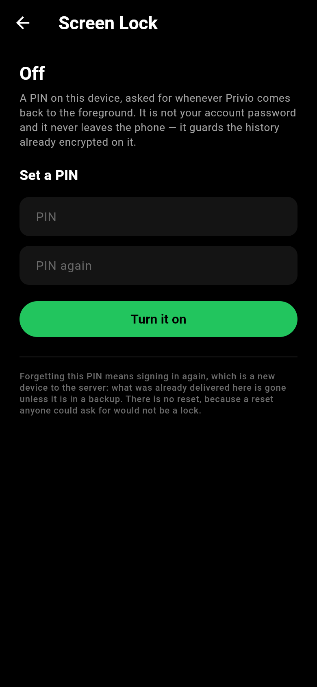<br><sub><b>1.</b> The app lock, settable at last: 4 digits, 6 digits or a passphrase.</sub></td>
<td align="center" width="25%">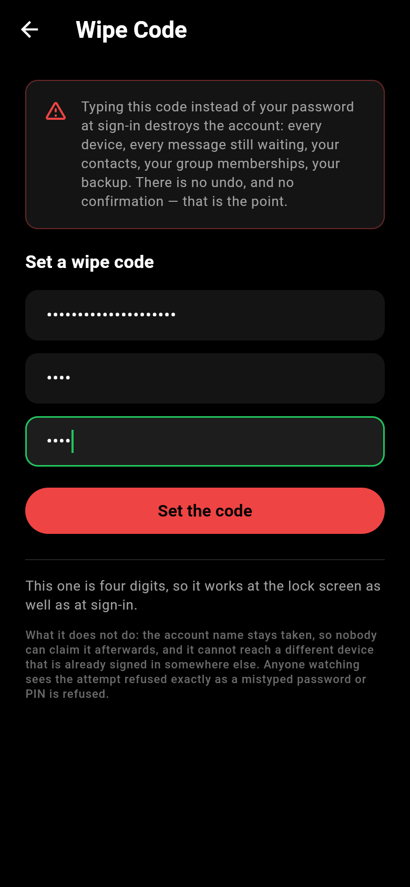<br><sub><b>2.</b> A duress code shaped like the lock says so: it reaches the lock screen as well as sign-in.</sub></td>
<td align="center" width="25%">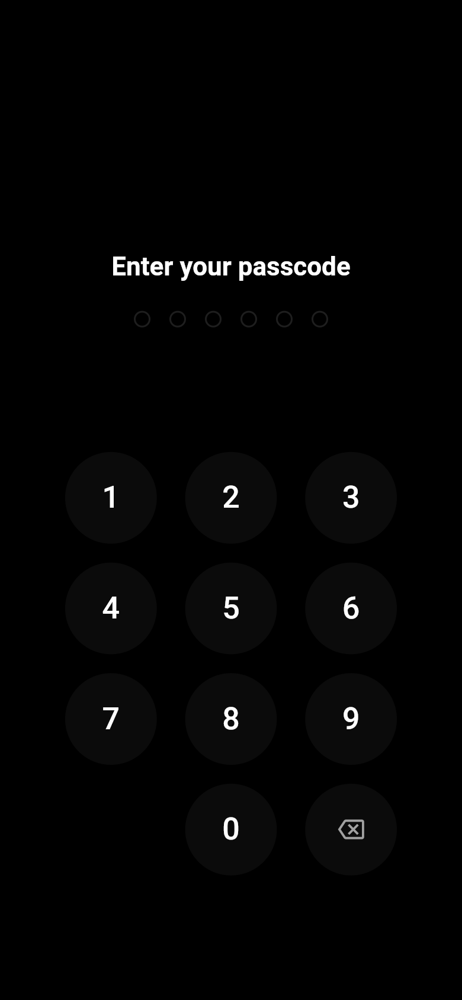<br><sub><b>3.</b> Reopened: locked. Six dots, because that is the shape this device chose.</sub></td>
<td align="center" width="25%">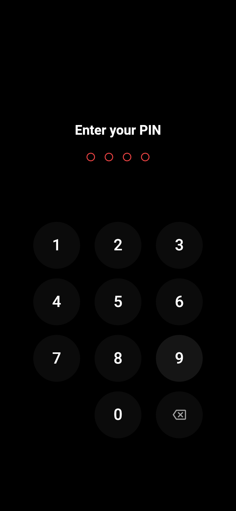<br><sub><b>4.</b> The duress code typed here — the same refusal a wrong passcode gets, and the account is gone.</sub></td>
</tr>
</table>

<table>
<tr>
<td align="center" width="25%"><br><sub>The same lock with a passphrase chosen: a field instead of a keypad, and no fingerprint icon anywhere.</sub></td>
<td width="75%"></td>
</tr>
</table>

There is no face or fingerprint unlock, and that is the design rather than a
gap. Biometrics are the one credential a person can be made to present while
unwilling, asleep or unconscious, and in several places a court can order them
where it cannot order a passcode. In an app that ships a duress code for
exactly that situation, offering one would hand back what the duress code is
there to protect. `local_auth` is not a dependency any more.

The local wipe happens first and unconditionally: the phone is in someone
else's hands, and the network is the part that might not be there. The history,
this device's Signal identity and the session go immediately; the server is
asked afterwards, on a best-effort call carrying the code rather than the
password — under duress the password is the one thing nobody is about to type.
A duress code that is not shaped like this device's lock — a phrase where the
lock is a keypad, six digits where the lock takes four — works at sign-in only,
and the screen says which kind you have rather than letting you believe it is
armed somewhere it can never be typed.

### A backup only you can open

A history sealed on the device, a key that exists nowhere else, and a new
device that gets the conversations back by typing it in. The server holds 451
bytes it cannot read.

<table>
<tr>
<td align="center" width="25%"><br><sub><b>1.</b> The recovery key, as text and as a QR for the next device.</sub></td>
<td align="center" width="25%"><br><sub><b>2.</b> A fresh device: never backed up here, but there is one on the server.</sub></td>
<td align="center" width="25%"><br><sub><b>3.</b> The key goes in. It never went anywhere near Privio.</sub></td>
<td align="center" width="25%"><br><sub><b>4.</b> The conversation is back.</sub></td>
</tr>
</table>

That work also removed two invented numbers from the account screen — a storage
figure and a "Security Level: High" — that nothing had measured. A screen about
trust is the last place for decoration.

### A join link, and a key that follows it

The same discipline applied to channels. A reader opens a plain link, joins, and
sees padlocks — because the link carries no key. The key arrives afterwards,
sealed to their device by someone who already holds it, and the feed unlocks
without anyone doing anything further.

<table>
<tr>
<td align="center" width="33%"><br><sub><b>1.</b> The link is safe to post anywhere: no key in it.</sub></td>
<td align="center" width="33%"><br><sub><b>2.</b> The reader is in, and can read nothing yet.</sub></td>
<td align="center" width="33%"><br><sub><b>3.</b> The key arrives from a member's device; the posts open.</sub></td>
</tr>
</table>

That run found three more: the channel listing returned a role but no
permissions, so reopening a channel silently stripped its owner's rights; a
group you joined by a link never appeared in the chat list until somebody spoke
in it; and the permission sheet's **Save** button sat below the fold on a
390×844 screen. All three are fixed.

### A call the server routes without knowing who is calling

Setting up a call means the two devices telling each other how to be reached.
That exchange — the SDP offer and answer, and the ICE candidates — is a list of
every address each device has: local, public, and whatever the network in
between reveals. Send it in the open and the relay learns where both people
are, which is most of what a call would have told it anyway.

So it does not go in the open. A call signal is a payload like any other: sealed
to the other device over the Signal session the chat already uses, handed to the
server as ciphertext, and matched to a call on the far side. The server needed
no new endpoint for calls at all — the existing envelope queue was already the
right shape, and that is the whole point.

<table>
<tr>
<td align="center" width="20%">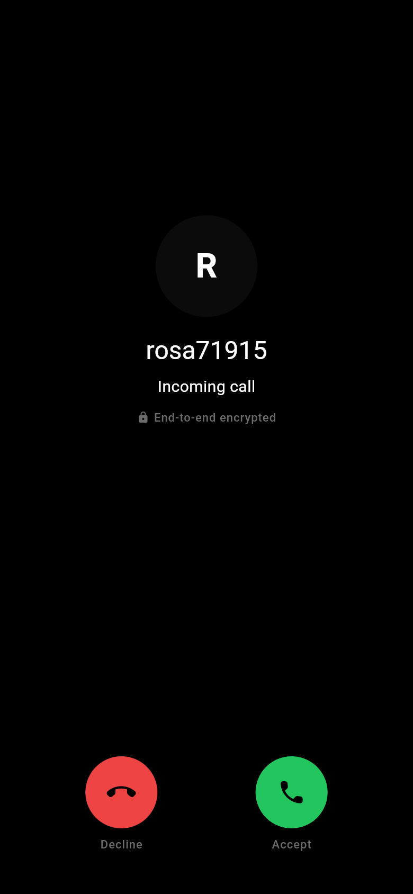<br><sub><b>1.</b> The offer arrives sealed; the phone rings with a name.</sub></td>
<td align="center" width="20%">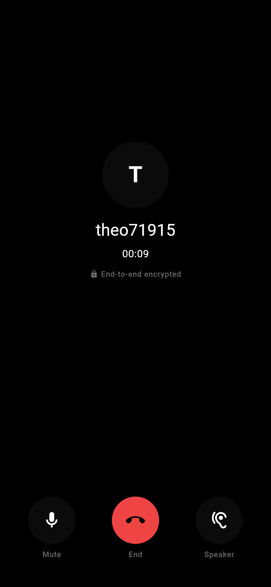<br><sub><b>2.</b> Connected — DTLS-SRTP, keys agreed device to device.</sub></td>
<td align="center" width="20%">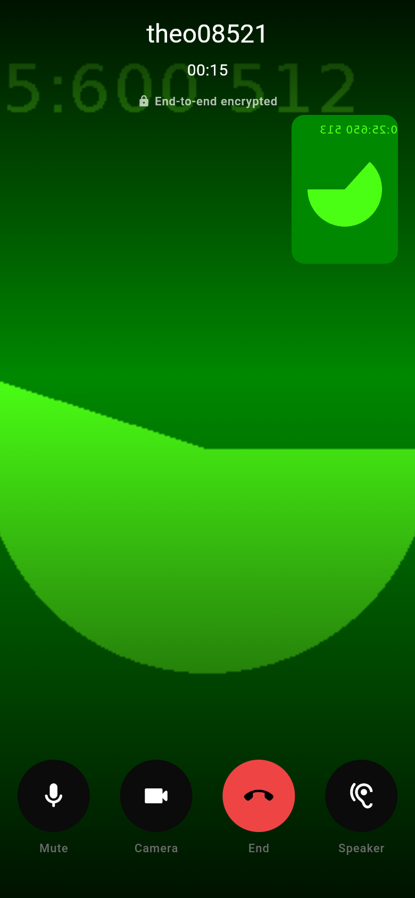<br><sub><b>3.</b> Video, with your own camera in the corner.</sub></td>
<td align="center" width="20%">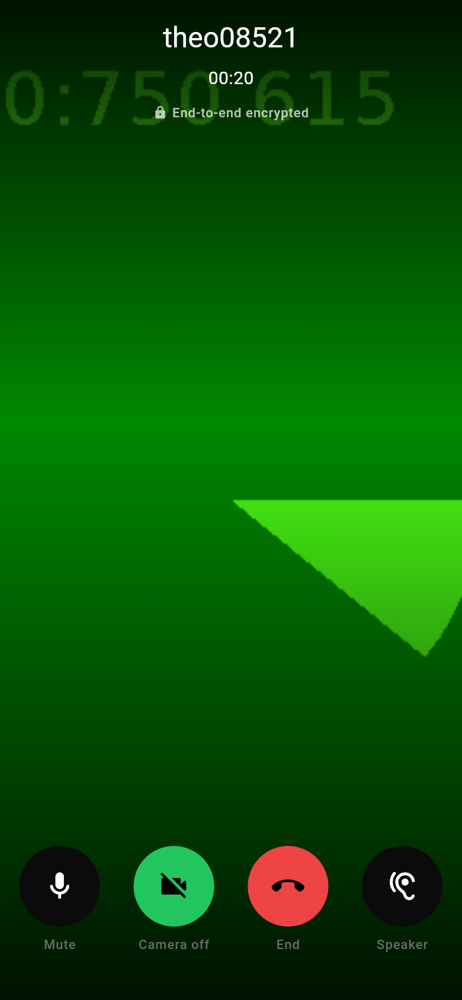<br><sub><b>4.</b> Camera off stops the track, not just the icon.</sub></td>
<td align="center" width="20%">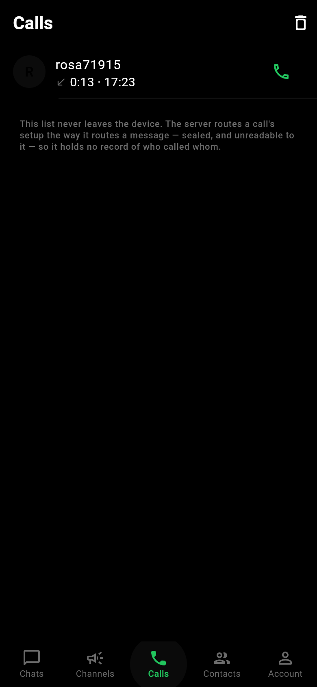<br><sub><b>5.</b> The log is on the device and nowhere else.</sub></td>
</tr>
</table>

The media itself is libwebrtc's, through `flutter_webrtc`, encrypted with
DTLS-SRTP as that library implements it. Privio writes no cipher of its own
here, as everywhere else.

Video is the same call with a camera in it. The remote picture is drawn
full-bleed with the name, the timer and the line about encryption held over a
scrim at the top — centred, they sat in the middle of whatever the other camera
happened to be pointed at. Your own camera goes in a small mirrored window, and
the camera button disables the track rather than only the icon. A voice call
gets no camera button at all: turning one on mid-call is a renegotiation this
does not do yet, and a button that quietly does nothing is the thing this app
keeps deleting. What Privio owns is the part that goes wrong — a
goodbye for a call that already ended, a candidate arriving before anyone
picked up, two people calling each other in the same second — and that part sits
behind an interface so all of it is tested without a microphone in the room.

**Where to find each other comes from the server.** A deployment sets
`ICE_SERVERS` once — a STUN address, a TURN address, or neither — and every
client picks it up from `GET /v1/calls/ice`; nothing is compiled into the
build. Where a TURN relay needs credentials, the server mints time-limited ones
under coturn's `use-auth-secret` scheme, because a fixed username and password
shipped inside a client is a public relay within a day. The username is the
expiry and nothing else: putting an account id in it, as the scheme allows,
would let the relay operator tie every relayed call to an account, which is the
exact linkage the rest of this server is built to avoid.

Clients fetch it when they sign in and hold it until it is close to expiring —
deliberately **not** when a call starts. Asking at that moment would tell the
server a call is about to happen, and the signalling is sealed precisely so it
cannot know that. A test pins it, and the server's own request log across a real
call shows the fetch at sign-in and none at dial time.

Configure nothing and you get nothing, which is a real answer: the two devices
then try only the addresses they can see for themselves, which works on the same
network and behind simple NATs and fails behind strict ones. Privio runs no
relay of its own to point you at.

One limit remains: a call can only arrive while the app is open, because waking
a closed app needs the push registration that is still missing on the client.

Driving it in a real browser, two accounts on one machine, is what turned up
the bug worth having: the call screen was swapped in at the app's `home` route,
so it rendered *underneath* anything the user had pushed. The callee's phone
rang; the caller sat looking at their own chat with no way to hang up. It lives
above the navigator now, and a test pins it there.

### A second device that sees the same conversation

Signing in twice already worked, in the sense that both devices received. What
arrives is fanned out to every device an account has, so Ben's reply reached
Ann's phone and her laptop alike.

What Ann sent from her phone reached only her phone. The laptop showed a
conversation in which she never answered — not a shorter history, a wrong one.

<table>
<tr>
<td align="center" width="50%">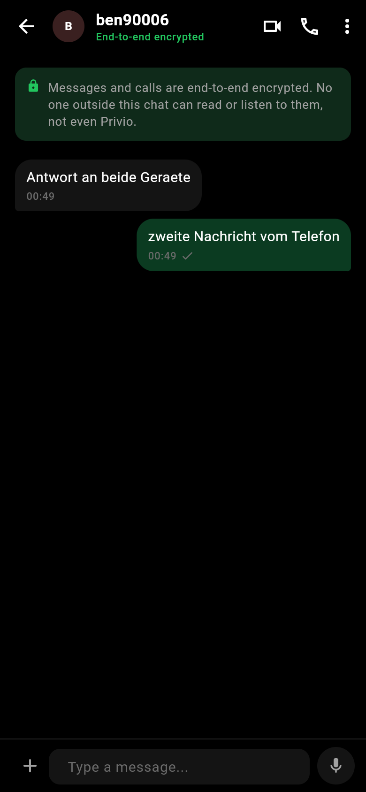<br><sub>The laptop, showing both sides.</sub></td>
<td align="left" width="50%">Every outgoing direct message now also goes to this account's own other devices, sealed to each of them like any other message, and is filed there as outgoing. Group messages already reached them: the group fan-out excludes only the device that sent, so a second device was always included — worth checking rather than assuming, and it was.</td>
</tr>
</table>

The copy is a wrapper, not a flag: the receiving device has to file it as
*outgoing in a named conversation*, which is a different act from receiving a
message from somebody. An attachment is carried by reference — the same media
id and the same download capability — so it is uploaded once and both devices
open the same blob.

One honest limit. A device that was offline for a send has a gap nothing fills
but a backup: the copy is not retried, because a send that failed only its own
copy has still reached the person it was for, and turning that into a failure
would have the sender retry and the recipient receive twice.

A second device does start empty, and the encrypted backup is what fills it —
the route the welcome screen already offers under *Import from backup*: sign
in, paste the recovery key, and the history is there. I had written that this
was still to build, which was wrong, so I ran it end to end in the browser
instead of trusting the sentence.

<table>
<tr>
<td align="center" width="50%">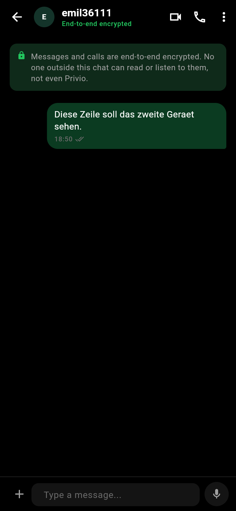<br><sub>A device that has never seen this chat, after restoring.</sub></td>
<td align="center" width="50%">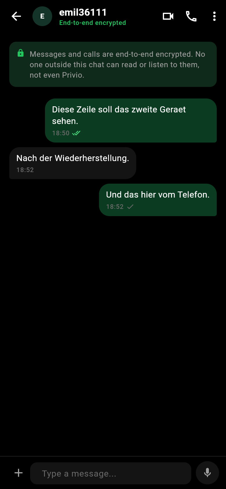<br><sub>The same device keeping up afterwards: the other side's reply, and the phone's own message.</sub></td>
</tr>
</table>

The second screenshot is the combination that could have quietly failed and
did not: a restore replaces the local archive wholesale, so a device that has
just done one still has to receive both the other side's messages and its own
account's synced copies. It does.

What is missing is not the past — it is a way to carry it without the
server-stored backup. Pairing device to device over a QR code is still to
build.

### A calculator that calculates

Disguise mode replaces the lock screen with a calculator, and replaces the
launcher entry with one too. Any sum that comes to the passcode opens Privio
when you press `=`. Any sum that comes to the duress code does what the duress
code does. Anything else gets the answer, because it is a calculator.

<table>
<tr>
<td align="center" width="20%">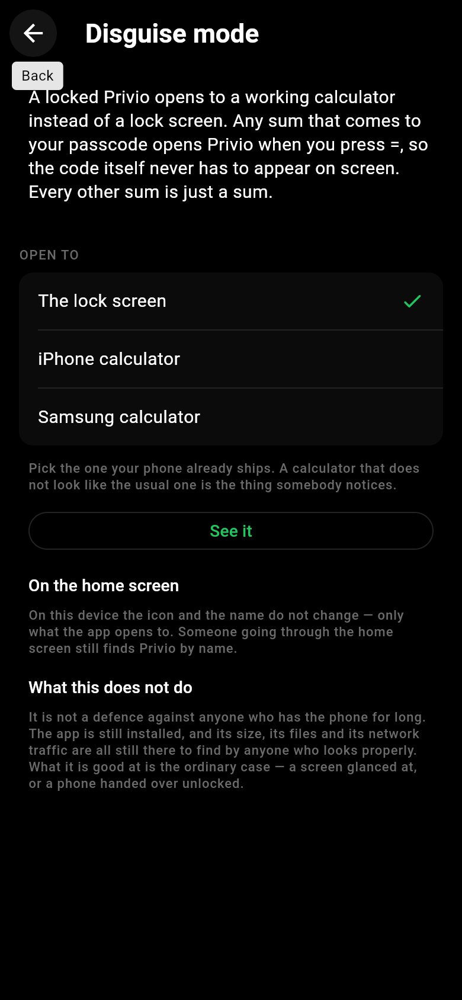<br><sub><b>1.</b> Off, or one of two skins.</sub></td>
<td align="center" width="20%"><br><sub><b>2.</b> What a locked phone opens to.</sub></td>
<td align="center" width="20%">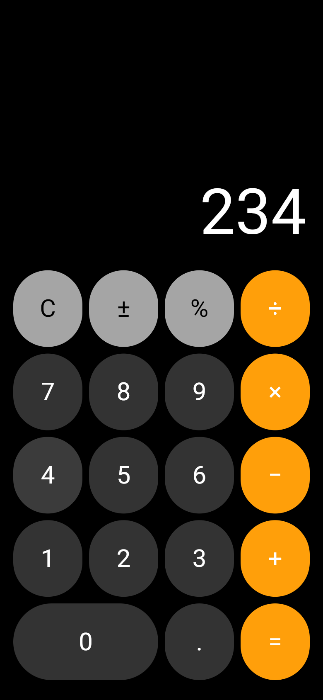<br><sub><b>3.</b> 1000 + 234, and 1234 never appears.</sub></td>
<td align="center" width="20%">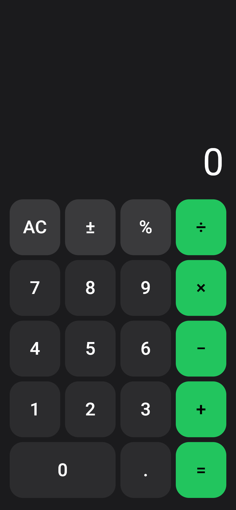<br><sub><b>4.</b> The other skin.</sub></td>
<td align="center" width="20%"><br><sub><b>5.</b> And on the home screen.</sub></td>
</tr>
</table>

**The answer is what is checked, not the keystrokes.** Typing the code and
pressing `=` works because a number on its own evaluates to itself — but so
does `1000 + 234`, which means the code never has to appear on screen for
somebody standing behind you to read. A wrong answer is not treated as a wrong
code either: no shake, no counter, no pause that says something was verified.
That pause is the only thing a disguise really has to avoid.

**The arithmetic is the feature.** A pad that echoes digits without adding them
is precisely what gets noticed, so this is a real immediate-execution
calculator — chained operations left to right, a repeating `=`, AC that becomes
C, percent that means a tip after `+` and a hundredth on its own, `Error` on a
divide by zero, grouped thousands, exponent notation past nine digits. It is a
plain object with no widgets in it, which is why thirteen tests on the
arithmetic alone were cheap, and they caught the percent key computing
`200 + 10 %` as 400.

**The home screen changes too — on Android.** Both the icon and the name swap:
the launcher entry is an `activity-alias`, so there are two of them pointing at
the same activity, and turning the disguise on enables one and disables the
other — in that order, because a moment with no enabled alias drops the app off
some launchers and can have Android stop the process. The alias's own
`android:label` is what the launcher draws, which is why the name changes and
not only the icon. The swap is read back afterwards and reported as a failure
if the system accepted the call and changed nothing.

Precisely, and this is the limit of it: what changes is the *launcher entry*.
Android's own app list — Settings, app info, the name shown when Privio asks
for a permission — reads the `<application>` label, which is fixed when the app
is built and cannot be changed at runtime. Someone scrolling the home screen
sees a calculator; someone opening Settings → Apps sees Privio.

**Not on iOS.** iOS can swap an icon and cannot change a name: an app's display
name is fixed when it is built and there is no public API to change it. That
would leave an iPhone showing a calculator icon still labelled *Privio* —
a disguise that says its own name underneath itself, which is worse than none,
because it invites exactly the question the disguise exists to avoid. So the
feature is not shipped on iOS at all: no calculator, no setting, no lock-screen
replacement. The row is absent from Settings rather than present and
explaining itself, and a disguise stored by some earlier install is dropped on
start-up rather than leaving the app locked behind a screen it will never draw.

That was a deliberate call over shipping the half that works. Half a disguise
is not a smaller disguise.

**Two skins**, because a disguise works by being unremarkable and a calculator
that does not look like the one the phone already ships is exactly what gets
asked about.

It cannot be switched on without a numeric passcode, and says so rather than
offering it: a calculator has ten keys and no letters. Turning the screen lock
off takes the disguise with it, and so do a wipe and a sign-out — a calculator
whose code nobody holds is a locked-out phone.

**What it still does not do.** It is not a defence against anyone who has the
phone for long: the app is installed, and its size, its files and its traffic
are all there to find by anyone who looks properly. It is for the ordinary case
— a screen glanced at, a phone handed over unlocked.

**What has not been run.** The Kotlin is unverified from here: `dl.google.com`
is blocked by this environment's egress proxy, so the Android SDK cannot be
fetched and the app has never been compiled for Android — no launcher has
actually redrawn. What has been checked is the manifest, by parsing it: one
activity with no launcher filter, two aliases targeting it, one enabled with
Privio's label and icon and one disabled with the calculator's, and
`calculator_name` defined for both flavours. The Dart side — when the swap is
asked for, what happens when the platform refuses, which devices are offered it
— is behind an interface and tested. Treat the icon and name swap as written
and reviewed, not as demonstrated.

### Nothing on a screen that the screen cannot do

The last pass through Settings pulled the controls that only looked like
controls: five notification toggles that set nothing, a Light-theme half that
was never built, and rows for chat wallpaper, accent colour and app icon that
led nowhere. What is left on Notifications is the delivery path, which is the
one thing there Privio actually decides; what is left on Appearance is text
size, and that one is real — four sizes, applied to every screen at once and
still in place after a restart.

Each of those passes turned up a bug under the decoration. The Devices screen
was listing four invented devices while answering the one question that screen
exists for; a settings screen opened a few times could exhaust a *login-grade*
rate limit and lock someone out of their own account; and a message that had
arrived perfectly well was reported as "1 message(s) could not be decrypted",
because the socket and the poll each delivered the same envelope once.

---

## What works today

| Area | Status | Detail |
| --- | :---: | --- |
| **Registration & login** | ✅ | Username + password. No phone number, no email |
| **End-to-end encryption** | ✅ | X3DH + Double Ratchet, one sealed copy per device |
| **Two-factor auth** | ✅ | TOTP (RFC 6238): set up in the app with a QR code, proved with a code before it takes effect, and enforced at login. The secret is sealed at rest under a key held outside the database, and a server without that key refuses to enrol rather than store one in the clear |
| **Duress code** | ✅ | Set in the app. Typed at sign-in *or* at the lock screen it destroys the account, and is refused exactly as a wrong password or passcode is |
| **Contacts** | ✅ | Exact-username lookup, no address-book upload |
| **Blocking** | ✅ | From the chat's menu; invisible to the blocked sender, and liftable in Privacy & Security |
| **Groups** | ✅ | Create, name (encrypted), send and receive — in the app |
| **Media** | ✅ | Client-encrypted attachments with enforced expiry |
| **Backup** | ✅ | Manual and automatic, sealed under a recovery key the server never sees; restore on a new device by key or QR |
| **At-least-once delivery** | ✅ | Envelopes are acknowledged only after they decrypt |
| **Push notifications** | 🔧 | The server sends contentless wake-ups and the endpoint takes a token; the Notifications screen offers the UnifiedPush path on the free builds, and the platform connector that would register a real token is not written yet |
| **Device management** | ✅ | The devices actually signed in, read from the server, with remote sign-out |
| **Second device** | ✅ | Sign in again and both devices receive, and both see what either one sends. History before the second sign-in comes from a backup, not from the first device |
| **App lock** | ✅ | A passcode set in the app — 4 digits, 6 digits or a passphrase — re-locking on backgrounding. No biometrics, on purpose |
| **Text size** | ✅ | Four sizes in Appearance, applied to every screen at once and kept across a restart, on top of whatever the phone is already set to |
| **Chat UI wired to crypto** | ✅ | Real accounts, real sends, real decryption |
| **Encrypted local history** | ✅ | AES-256-GCM under a key in the platform keystore |
| **Metadata stripped from files** | ✅ | GPS, camera, serial numbers, timestamps — automatically, no setting. JPEG, PNG, WebP, GIF and MP4/MOV; a PDF is passed through and says so rather than being half-stripped |
| **Attachments in the chat** | 🔧 | 1:1 and groups; send, receive and display work; the OS file dialog is untested (see below) |
| **Attachment authorisation** | ✅ | Downloading needs a capability minted at upload and carried inside the sealed payload — the server hands the bytes over without ever learning who is entitled to them. Only the token's hash is stored |
| **Profile pictures** | 🔧 | Encrypted end to end; same untested file dialog |
| **Message length hidden** | ✅ | Padded into buckets, so size says nothing |
| **Realtime delivery** | ✅ | WebSocket push — measured at 722 ms end to end, not 3 s |
| **Voice messages** | ✅ | Hold to record, slide to cancel, pause, preview, 1x/1.5x/2x; sealed before upload |
| **Read receipts & typing** | ✅ | Sealed like any message, reciprocal switches, 1:1 |
| **Replies & reactions** | ✅ | The quote travels inside the sealed payload; one reaction per person |
| **Disappearing messages** | ✅ | Per chat, agreed end to end; the server is never asked |
| **Offline queue** | ✅ | A recording made with no signal waits as ciphertext and goes when there is |
| **Voice calls** | ✅ | WebRTC over the Signal session the chat already uses: the SDP and the candidates are sealed to the other device, so the server routes a call without learning either party's address |
| **STUN / TURN** | ✅ | Configured on the server and handed to clients, with time-limited TURN credentials that name no account. Privio runs no relay of its own — a deployment points at its own, or at none |
| **Video calls** | ✅ | The camera button in a chat places one: the other side's picture full-bleed, your own in a small window, and a camera you can turn off mid-call |
| **Group calls** | 📋 | A different piece of machinery, not the same one with more people in it |
| **Channels** | ✅ | Public and private, both encrypted; discovery, feed, per-admin permissions, join links |
| **Join links** | ✅ | Shareable links for channels and groups; the key follows device to device, never through the server |
| **Disguise mode** | ✅ | Android and the web build: a locked Privio opens to a working calculator, in an iPhone or a Samsung skin. Any sum that comes to the passcode opens it; any sum that comes to the duress code wipes; anything else is arithmetic. Not offered on iOS |
| **Calculator icon and name** | 🔧 | Android only, through activity aliases: both the icon and the name on the launcher entry. Not offered on iOS at all — see below. Written and unit-tested behind an interface; the Kotlin has not been compiled from here, because the environment has no Android SDK |
| **License activation** | ✅ | Asked once at first start, in the builds that use a key; skippable, and remembered per account |
| **Editions** | ✅ | `libre`, `direct`, `play`, `appstore` from one source tree — a build-time fact, not a runtime setting |

✅ done and tested · 🔧 in progress · 📋 planned

---

## How a message travels

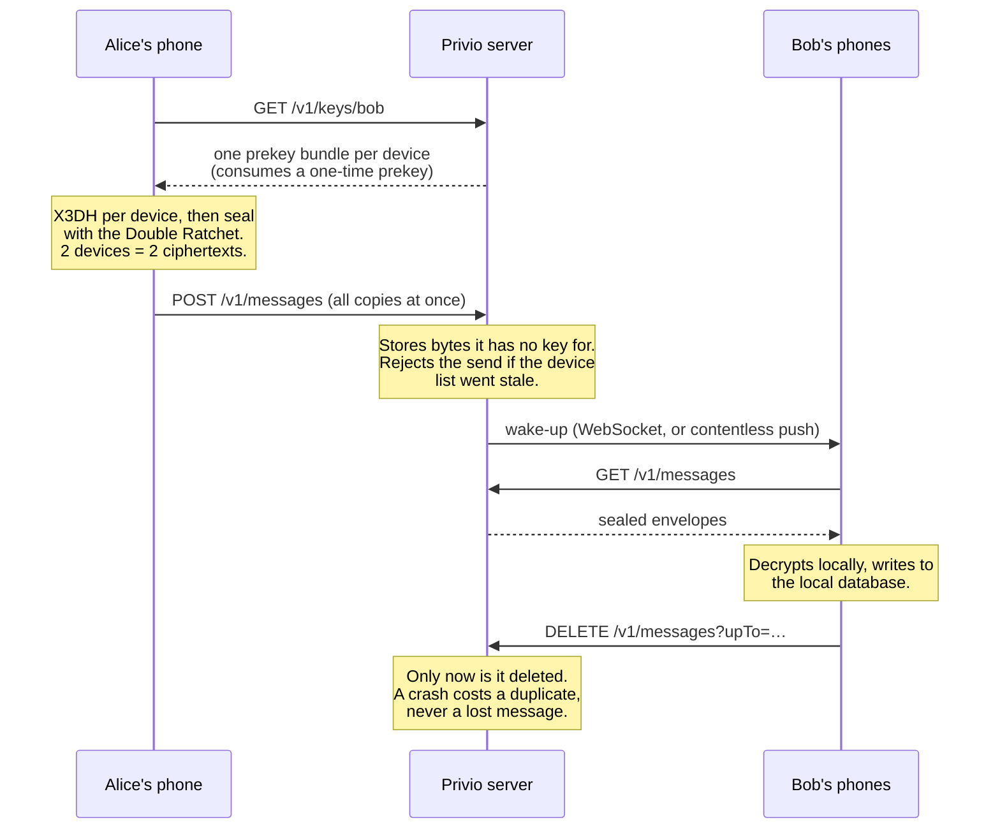
```mermaid
sequenceDiagram
    participant A as Alice's phone
    participant S as Privio server
    participant B as Bob's phones

    A->>S: GET /v1/keys/bob
    S-->>A: one prekey bundle per device<br/>(consumes a one-time prekey)
    Note over A: X3DH per device, then seal<br/>with the Double Ratchet.<br/>2 devices = 2 ciphertexts.
    A->>S: POST /v1/messages (all copies at once)
    Note over S: Stores bytes it has no key for.<br/>Rejects the send if the device<br/>list went stale.
    S->>B: wake-up (WebSocket, or contentless push)
    B->>S: GET /v1/messages
    S-->>B: sealed envelopes
    Note over B: Decrypts locally, writes to<br/>the local database.
    B->>S: DELETE /v1/messages?upTo=…
    Note over S: Only now is it deleted.<br/>A crash costs a duplicate,<br/>never a lost message.
```

---

## Architecture

```
 iOS / Android (Flutter)                     Server (Node.js + TypeScript)
 ┌──────────────────────────┐                ┌──────────────────────────────┐
 │ Screens · dark, minimal  │                │ Fastify HTTP + WebSocket     │
 │ Local encrypted database │                │                              │
 │ Signal Protocol session  │  sealed bytes  │ accounts · devices · keys    │
 │  · X3DH key agreement    │ ─────────────► │ envelopes · groups · channels│
 │  · Double Ratchet        │ ◄───────────── │ media · backups · licenses   │
 │ Keystore / Keychain      │   TLS 1.3      │                              │
 └──────────────────────────┘                └───────────┬──────────────────┘
                                                         │
                                         ┌───────────────┼───────────────┐
                                    PostgreSQL       Redis (opt.)   Blob storage
                                    routing +        fan-out across  ciphertext
                                    ciphertext       API instances   only
```

| Layer | Location | Responsibility |
| --- | --- | --- |
| Screens | `app/lib/screens/` | One file per screen in the design |
| Widgets | `app/lib/widgets/` | Rows, bubbles, avatars, the brand mark |
| Theme | `app/lib/theme/` | The measured design tokens |
| Messaging | `app/lib/services/` | The only place plaintext meets the transport |
| **Archive** | `app/lib/data/` | The decrypted history, sealed at rest |
| **Media** | `app/lib/media/` | Metadata scrubbing, per-file encryption, padding |
| **Crypto** | `app/lib/crypto/` | X3DH, the Double Ratchet, the key store |
| Transport | `app/lib/core/` | HTTP client, keystore, app state, the build's edition |
| API routes | `server/src/routes/` | Accounts, devices, contacts, messages, groups, channels, media, backup, licenses |
| Delivery | `server/src/services/` | Queueing, fan-out, push wake-ups |
| Schema | `server/migrations/` | Every content column is a `bytea` the server cannot read |

There is no state-management package in the client. `InheritedNotifier` covers
what the app needs, and every dependency in a security product is a dependency
someone has to audit.

---

## What the server can and cannot see

| It can see | It cannot see |
| --- | --- |
| Usernames and account creation time | Message text, voice notes, media, files |
| Which accounts exchange envelopes, and when | Group names and avatars |
| Device counts, and a padded size bucket | How long a message actually is |
| Group membership | Contact names and aliases you set locally |
| That a file was uploaded, and roughly how big | File names, types, or anything inside them |
| Attachment lifetimes | Search queries — search never leaves the device |

**Push notifications carry nothing.** They say "something arrived" and no more —
not the sender, not a preview, not a count. The device wakes, connects and
decrypts locally, so Apple and Google see traffic, never content.

---

## Metadata

Encryption protects what you write. It does nothing about everything *around*
what you write — and that is often the part that identifies you.

**Files are stripped before they are sent.** A photo out of a phone carries GPS
coordinates, the camera make and model, a serial number and the second it was
taken. Encrypting it delivers all of that intact to the recipient. Privio removes
it on the way out, every time, with no setting to forget:

| Format | Removed |
| --- | --- |
| JPEG | EXIF and XMP (GPS, camera, serial number, timestamps), IPTC, ICC profile, comments |
| PNG | Text and comment chunks, embedded EXIF, modification time, ICC profile |
| MP4 / MOV | User-data boxes (GPS, device make and model), metadata tags, recording timestamps |

Only container structure is touched — the pixels and the audio are passed through
byte for byte, so nothing is re-encoded and nothing degrades. A format Privio
cannot clean is still sent, encrypted, but the app says so rather than letting
you assume otherwise.

**Message length is padded away.** Ciphertext length tracks plaintext length, and
the server sees every ciphertext. Unpadded, "yes" is distinguishable from a
paragraph. Every payload is padded into a doubling bucket before it is sealed, so
the server observes a handful of sizes instead of a continuum — and a text
message is indistinguishable from a photo being sent.

Attachments are padded the same way. Be precise about what that buys: for short
messages it is near-total, since everything under 256 bytes looks identical. For
a large file it means an observer learns the size only to within a factor of two,
which is a real improvement over the exact byte count but is not invisibility.

**Profile pictures are encrypted too.** A messenger that promises the server
cannot read anything, and then stores everyone's face in the clear, has not kept
the promise. An avatar is sealed with a long-lived *profile key* that reaches
contacts inside end-to-end encrypted messages and never reaches the server — so
the server holds a picture it cannot open, and only people you have actually
written to can see it. It is also re-encoded to 512×512 on the way out, which
strips metadata a second time and stops a full-resolution photo of your
surroundings from becoming your avatar.

**Channels are encrypted, public ones included — with a caveat worth stating.**
A post is sealed once under a channel key, so the server stores something it
cannot read, search or hand over. What that does *not* do is keep a public
channel secret from its own audience: if anyone may join, anyone may hold the
key. What matters is that the key never passes through the server. A join link
(`https://privio.channel/c/<code>`, or `https://privio.group/g/<code>` for a
group) is meant to be shared — posted on a website, sent through another
messenger — so it carries no key at all, only the code that names the channel. The key follows
separately: the joining device records a request, and a member who already holds
the key seals it to that device over the Signal session between the two
accounts. The server routes both halves and can read neither, which is what
stops it from simply subscribing to everything. A public channel's handle, title
and description are plaintext, because search cannot run over ciphertext; its
posts are not. Groups have the same kind of link, and their sealed name travels
the same way.

**A voice message is an attachment, and gets the same pipeline.** It is sealed
on the device under its own random key, padded, and uploaded as ciphertext; the
server stores audio it cannot play. The duration and the waveform ride *inside*
the sealed payload, not beside the upload, so the bubble is complete before
anything is downloaded and the server never learns how long anyone spoke. The
encoder's working file is overwritten and deleted the moment its bytes have been
read, and playback runs from memory — a decrypted recording is never written to
disk.

**Disappearing messages are an agreement, not a request to the server.** The
timer travels inside each sealed payload; both devices adopt it and delete on
their own clocks. Asking a server to forget something is trusting it to.

**File names never leave the encrypted envelope.** `passport_scan.pdf` travels
inside the sealed message next to the key, never beside the upload.

**The app fetches nothing from a third party to draw itself.** A Flutter web
build normally pulls its renderer from `gstatic.com` and its fallback font from
Google's font CDN on first paint, which tells a company that has nothing to do
with this messenger who opened it, from which address, and when. Both now ship
inside the build: the renderer is loaded from the bundled CanvasKit
(`app/web/flutter_bootstrap.js`) and the typeface from `app/assets/fonts`
(Roboto, Apache-2.0), declared as the app's own family so it is the file that
actually renders. One gap remains and is worth naming: on the **web** build,
emoji glyphs are not in the bundled font, so the engine still asks Google's CDN
for them — the alternative is a 10 MB colour-emoji file in every download. On
iOS and Android the system supplies emoji and nothing is fetched. Verifying
that on a real device is part of the device pass below.

---

## Cryptography

Privio writes **no cryptographic primitives of its own.** It composes audited
implementations of established protocols.

| Purpose | Choice |
| --- | --- |
| Message encryption | Signal Protocol — X3DH + Double Ratchet |
| Password hashing | Argon2id, 64 MiB, t=3, p=1 |
| Session tokens | 256-bit random, stored only as SHA-256 |
| Transport | TLS 1.3 |
| Attachments | AES-256-GCM, a fresh random key per file, size padded |
| Backups | AES-256-GCM under a key derived (HKDF-SHA256) from your recovery key |
| Local history | AES-256-GCM under a key in the platform keystore |
| Profile pictures | AES-256-GCM under a profile key, shared only with contacts |
| License keys at rest | HMAC-SHA256 under a server secret — deterministic, because a redemption arrives with the key and nothing to look it up by |
| Two-factor | TOTP, RFC 6238 |

### The caveats, stated plainly

A privacy product that overstates itself is worse than one that says nothing.

1. **The protocol implementation is a port, not the audited original.** Messages
   are genuinely end-to-end encrypted, and the tests prove a third party holding
   the ciphertext cannot open it. But it runs on `libsignal_protocol_dart`, a
   pure-Dart port rather than the official audited Rust `libsignal`. Moving to
   the official library behind FFI is a **pre-launch requirement**.
2. **The local history is one sealed blob, not a database.** It is encrypted
   correctly, but rewritten whole on every change, so it will not scale to a
   long history. Moving it to SQLCipher is planned; the storage port exists so
   that swap touches one file.
3. **No sealed sender.** Envelopes name the sender, which the server uses for
   blocking and rate limiting.
4. **The link domains are not registered.** Links are generated against
   `privio.channel` and `privio.group`, neither of which this project owns, so
   nothing on the open internet answers them. It costs nothing in security —
   the app reads the invite code out of the link's *path* and never fetches the
   URL, so a link works between Privio users either way, and the parser accepts
   a link that has been shortened or re-hosted for the same reason. But a link
   a recipient cannot click is a worse link. Registering the domains (and
   confirming both TLDs are actually available) and shipping a `privio://` deep
   link beside them is a launch task; each host is one constant,
   `ChannelService.channelLinkHost` and `groupLinkHost`.
5. **A wipe reaches this device and the server, not other devices.** Typing the
   duress code destroys this device's history, identity and session, and asks
   the server to destroy what it holds — devices, queued envelopes, contacts,
   group memberships, the backup. It cannot reach a *different* phone that is
   signed in elsewhere, whose local archive stays sealed but present. The
   screen says so instead of implying a remote kill switch.
6. **No independent audit.** Before any public release the crypto integration
   needs review by someone who did not write it.

The full list, with the reasoning, is in
[`docs/security-model.md`](docs/security-model.md#known-gaps-in-the-current-implementation).

---

## Quick start

### Server

Requirements: Node.js 22+, PostgreSQL 14+. Redis is optional — it is only needed
once a second API instance exists.

```bash
cd server
cp .env.example .env          # then edit DATABASE_URL
npm install
npm run migrate               # migrations also run automatically on boot
npm run dev                   # http://localhost:8080
```

A server you run yourself needs no licensing configuration: `LICENSE_REQUIRED`
defaults to `false`, the server then answers `required: false`, and no client
ever asks anyone for a key. Setting it to `true` also requires
`LICENSE_HASH_SECRET`, and the server refuses to boot without it rather than
run a paid service that cannot tell who has paid — see
[`docs/licensing.md`](docs/licensing.md#configuration).

Calls find each other through whatever `ICE_SERVERS` names — a STUN address, a
TURN address, both, or nothing. Clients read it from the server, so pointing a
deployment at a relay is one line in `.env` rather than a rebuilt app. A TURN
server that wants credentials gets time-limited ones minted per request; set
`TURN_SECRET` to the same value as coturn's `static-auth-secret`.

```bash
curl http://localhost:8080/health
# {"status":"ok","version":"0.1.0"}
```

### App

Requirements: Flutter 3.22+.

```bash
cd app
flutter pub get

# The client ships as flavours now, so `flutter run` needs one.
# 10.0.2.2 is how an Android emulator reaches the host's localhost.
flutter run --flavor libre --dart-define=PRIVIO_EDITION=libre \
  --dart-define=PRIVIO_API_URL=http://10.0.2.2:8080
```

The editions and what separates them are in
[`app/README.md`](app/README.md).

### Tests

The server suite runs against a **real PostgreSQL database** — no mocks, because
the parts worth testing are the queries.

```bash
createdb privio_test
cd server && TEST_DATABASE_URL=postgres://you@localhost:5432/privio_test npm test
#  115 passing

cd app && flutter analyze && flutter test
#  285 passing
```

Among the things those tests assert:

- a third party holding the exact bytes the server stores **cannot** open them
- changing **one byte** of a message makes it undecryptable rather than wrong
- the same plaintext **never** produces the same ciphertext twice
- a used one-time prekey is **deleted**, so forward secrecy holds
- a **swapped identity key is refused on send** — the attack this all exists to stop
- the history at rest is **ciphertext** — not the messages, not even the contact names
- a different key **cannot** read that archive, and a tampered one is discarded
- a photo's **GPS, camera model and serial number** are gone from what the recipient receives
- an avatar on the server is **not a picture** — a stranger's key opens nothing
- a group's **name is ciphertext** to the server; only members with the key read it
- a **private channel** answers a stranger exactly as it answers about one that does not exist
- a deleted post's ciphertext is **overwritten**, not left waiting for a key
- an admin **cannot grant a permission they lack**, so delegation is not takeover
- a **join link carries no key** — not in the path, not in a fragment, nowhere
- a device that joins with only a link reads **padlocks**, until a member sends the key
- a key request from someone who has **left** is deleted rather than answered
- a second group message **reuses the session** instead of draining prekeys
- "yes" and a full paragraph produce **exactly the same ciphertext length**
- a 40-byte, a 100-byte and a 200-byte file all **upload at the same size**
- a photo sent through the real send path arrives **stripped**, and the server's copy gives nothing away
- a photo sent to a **group** is uploaded **once**, not once per member, and scrubbed just the same
- a voice message's bytes on the server are **not the recording** — and a tampered one refuses to play
- a **retry** after a lost connection delivers the recording **once**, not twice
- a recording queued with no network sits at rest as **ciphertext**, and goes out when the network returns
- a chat's disappearing timer is **never sent to the server** and is applied by both sides
- a backup on the server is **ciphertext** — no names, no messages, no attachment keys
- the **wrong recovery key** opens nothing, and a failed restore leaves the device's history alone
- a recovery key survives being **written down and typed back in**, including O for 0
- a receipt is **never** filed as a message, and carries no readable word on the wire
- a **self-hosted** server never puts a license key in front of anyone, because it says it needs none
- "Not now" at first start is remembered **per account**, so the next account is still asked
- a **store build** is never asked for a key, on the very same server that asks the Libre build
- two-factor is **not on** until a code from the new secret has been checked, and the secret is forgotten once it is
- **reading your own account** is not rationed like a login — but guessing a password still is
- typing the printed `PRIVIO-` prefix by hand does not end up **inside** the key
- an envelope that arrives **twice** — pushed and polled — is opened once, and never reported as broken
- a **reaction** to a message this device does not have is dropped, not turned into a bubble
- a reply's quote travels **inside the sealed payload**, so the server never learns what answered what
- delivery state **never walks backwards**, however receipts are ordered
- a receipt names **specific messages**, not "everything up to now"
- a session token in a socket URL is **redacted** before it reaches the logs
- a duress wipe is **indistinguishable** from a mistyped password
- a duress code **equal to the password** is refused, because an ordinary sign-in would fire it
- the duress code at the lock screen wipes **before** it tries the network, so a phone with no signal still loses its copy
- turning the app lock off **takes the duress code with it**, rather than leaving a wipe armed on a screen nobody sees
- blocking is **invisible** to the blocked sender

---

## API at a glance

| Endpoint | Purpose |
| --- | --- |
| `POST /v1/accounts` | Register a username and its first device |
| `POST /v1/sessions` | Log in, registering the calling device |
| `GET /v1/keys/:username` | One prekey bundle per device of that user |
| `POST /v1/keys/one-time` | Top up the published prekey pool |
| `POST /v1/messages` | Send one sealed copy per recipient device |
| `GET /v1/messages` | Drain this device's queue |
| `DELETE /v1/messages?upTo=` | Acknowledge, which deletes server-side |
| `GET /v1/ws` | Realtime delivery socket |
| `POST /v1/groups` | Create a group with encrypted metadata |
| `POST /v1/media` | Upload an already-encrypted attachment |
| `PUT /v1/backup` | Upload an already-encrypted backup |
| `GET /v1/licenses/me` | What this account's license looks like, and whether this server wants one |
| `POST /v1/licenses/redeem` | Bind a license key to this account |

Full route list in [`docs/architecture.md`](docs/architecture.md).

---

## Project layout

```
privio-messenger/
├── app/                    Flutter client (iOS + Android)
│   ├── lib/crypto/           X3DH, Double Ratchet, key store, padding
│   ├── lib/media/            Metadata scrubbing and attachment encryption
│   ├── lib/services/         Messaging: the plaintext boundary
│   ├── lib/screens/          One file per screen
│   ├── lib/widgets/          Shared components
│   ├── lib/theme/            Design tokens
│   ├── assets/fonts/         The bundled typeface, so nothing is fetched to draw the app
│   ├── web/                  Bootstrap that loads the renderer from the build, not a CDN
│   └── test/                 362 tests, incl. the crypto round trip
├── server/                 Node.js + TypeScript API
│   ├── src/routes/           HTTP endpoints
│   ├── src/services/         Delivery, storage, sessions
│   ├── migrations/           SQL schema
│   └── test/                 130 tests against real PostgreSQL
├── design/                 Brand assets and the source mockups
└── docs/                   Architecture, security model, design system, licensing, Libre
```

---

## Design

Dark-first, because it is the brand and because true black costs nothing on the
OLED panels most phones ship with.

| Token | Value | Use |
| --- | --- | --- |
| `accent` | `#22C55E` | Primary actions, active tab, read ticks, online dots |
| `background` | `#000000` | App background |
| `surface` | `#0B0B0B` | Cards and list rows |
| `bubbleOutgoing` | `#0B3B21` | Your messages |
| `danger` | `#EF4444` | Duress code, missed calls, destructive actions |

The full system — typography, spacing, every screen and component — is in
[`docs/design-system.md`](docs/design-system.md), measured from the mockups in
`design/mockups/`.

---

## Roadmap

**Done** — Authentication · Accounts · Contacts · E2EE 1:1 messaging · Groups ·
Media · Voice messages · Backup · Channels · Join links · Read receipts and
typing · Replies and reactions · Disappearing messages · License activation ·
Two-factor · Blocking · Duress code · Encrypted voice and video calls · Disguise mode

**Next** — Ringing a closed app, which needs the push registration the server
is already waiting for · Pairing a second device directly, over a QR code,
rather than by restoring the encrypted backup

**Later** — Sealed sender · SQLCipher for the local history

Before any of that ships to a store: the official `libsignal` behind FFI, an
external review of the crypto integration, and a pass on a real device for the
file picker and the microphone. Those are in
[the caveats](#the-caveats-stated-plainly), not on this list, because they are
conditions rather than features.

---

## Open source

Privio is free software under **AGPL-3.0** — the client and the server both.
Run it, read it, change it, redistribute it. If you run a modified server for
other people, section 13 means those people are entitled to your changes; that
network clause is the reason for AGPL rather than GPL, in a project whose whole
argument is that you should not have to trust the operator.

**Privio Libre** is the build with nothing proprietary in it: no Play services,
no Firebase, no analytics, no push SDK. It is a Gradle flavour, so the
guarantee is enforced by the build rather than remembered — see
[`docs/privio-libre.md`](docs/privio-libre.md). F-Droid builds it from
[privio-libre-open-source-fdroid](https://github.com/nfnc666/privio-libre-open-source-fdroid).

A license key is a different thing from the licence: it pays for the hosted
relay, is redeemed once, and belongs to one account for good. It does not
unlock the app — you already have all of the app. Self-hosted servers require
no key at all.

### Asked once, at first start — in the builds that use a key

On a server that sells access, a new account is asked for its key immediately
after it is created, instead of finding out later that it cannot send. That is
the **Libre build and the APK from getprivio.com**. A Play or App Store build was
paid for at the moment it was installed, so it is never shown a key field: it
goes straight into the app, and if it still comes back unlicensed that is a
receipt to settle with the store.

<table>
<tr>
<td align="center" width="25%">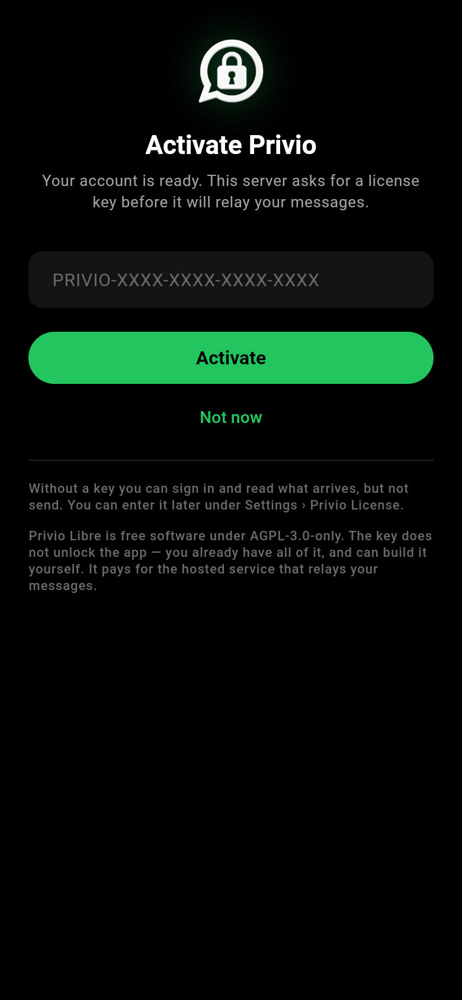<br><sub><b>1.</b> Straight after sign-up, and only where the server said it needs one.</sub></td>
<td align="center" width="25%">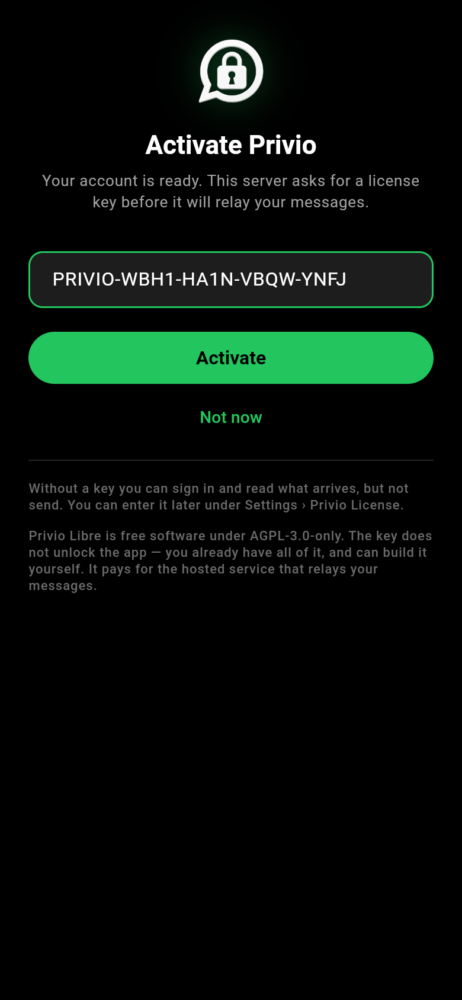<br><sub><b>2.</b> The field formats as you type; case and separators do not matter.</sub></td>
<td align="center" width="25%">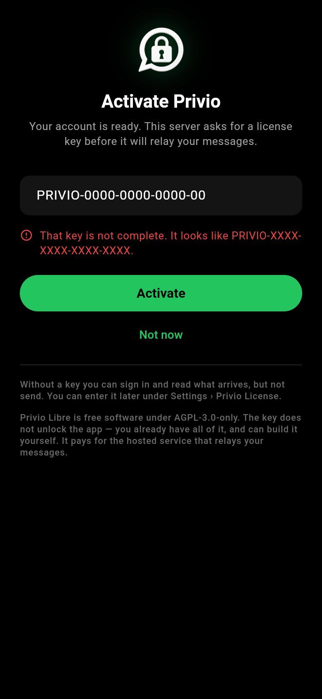<br><sub><b>3.</b> A key the server does not know is said plainly, and the step stays put.</sub></td>
<td align="center" width="25%">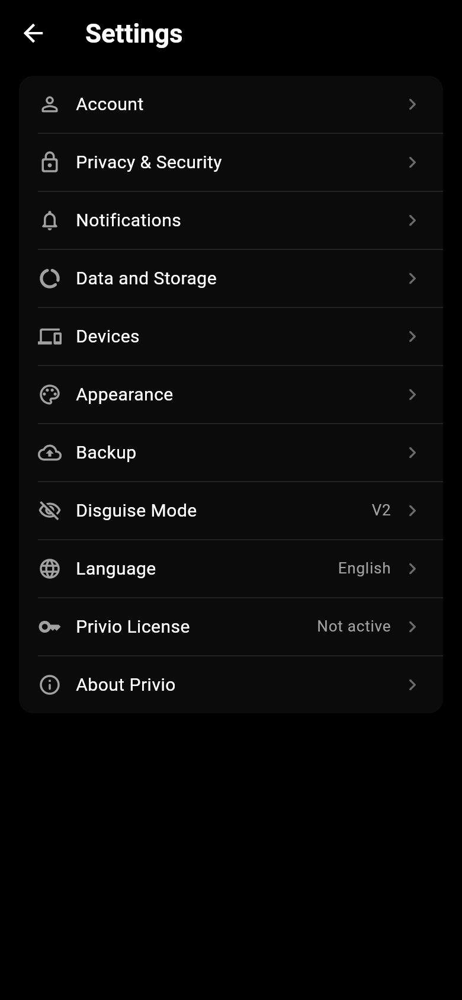<br><sub><b>4.</b> After "Not now": still there, in Settings, marked <i>Not active</i>.</sub></td>
</tr>
</table>

<table>
<tr>
<td align="center" width="25%">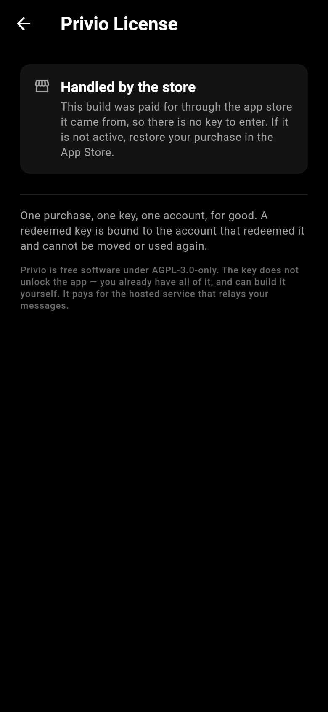<br><sub>The same server, a store build: no key field anywhere, because there is no key its owner could have.</sub></td>
<td width="75%"></td>
</tr>
</table>

It is a step, not a wall. The server lets an unlicensed account sign in and
read what has already arrived — only sending is gated — so **Not now** goes
through to the app, and the question is not asked again for that account. A
screen that refused to let anyone past would be the client inventing a
restriction the server does not apply, in a build anyone can compile with that
screen deleted.

| | |
| --- | --- |
| [LICENSE](LICENSE) | AGPL-3.0, in full |
| [CONTRIBUTING.md](CONTRIBUTING.md) | How to propose a change |
| [CODE_OF_CONDUCT.md](CODE_OF_CONDUCT.md) | What the project spaces expect |
| [SECURITY.md](SECURITY.md) | Where a vulnerability goes, and what happens next |

---

## Contributing rules that are not negotiable

1. **No custom cryptography.** Use audited implementations of established
   protocols. If you find yourself writing a cipher, stop.
2. **No plaintext to the server.** If a new field could carry user content, it
   is a `bytea` the server cannot interpret.
3. **Say what is not done.** An overstated privacy claim is worse than a missing
   feature.

---

## Documentation

| Document | What it covers |
| --- | --- |
| [Architecture](docs/architecture.md) | How the pieces fit, and how a message travels |
| [Security model](docs/security-model.md) | What is protected, what is not, and what is still missing |
| [Design system](docs/design-system.md) | Colours, typography, every screen and component |
| [Licensing](docs/licensing.md) | How a license key is issued, redeemed and enforced |
| [Privio Libre](docs/privio-libre.md) | The free-software build, AGPL-3.0, and reproducibility |
| [Notifications](docs/notifications.md) | Wake-ups without a proprietary push service |
| [Client editions](app/README.md) | The four builds, what separates them, and how to build each |

<div align="center">
<br>
<sub>Built with privacy in mind. No tracking. No ads. Just you.</sub>
</div>
