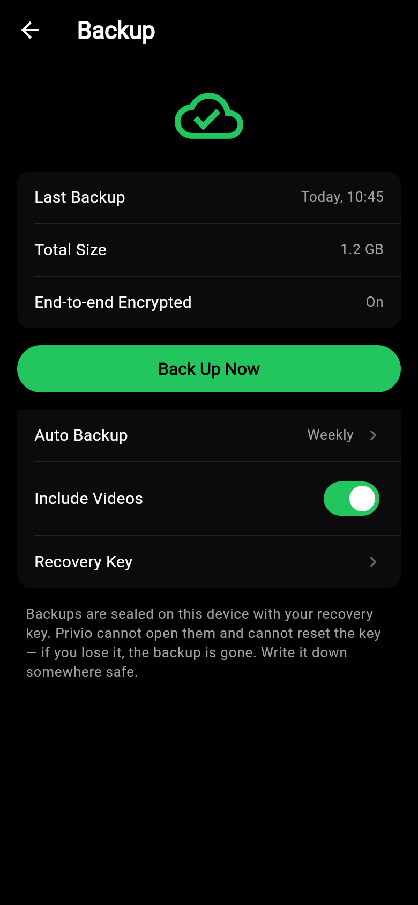
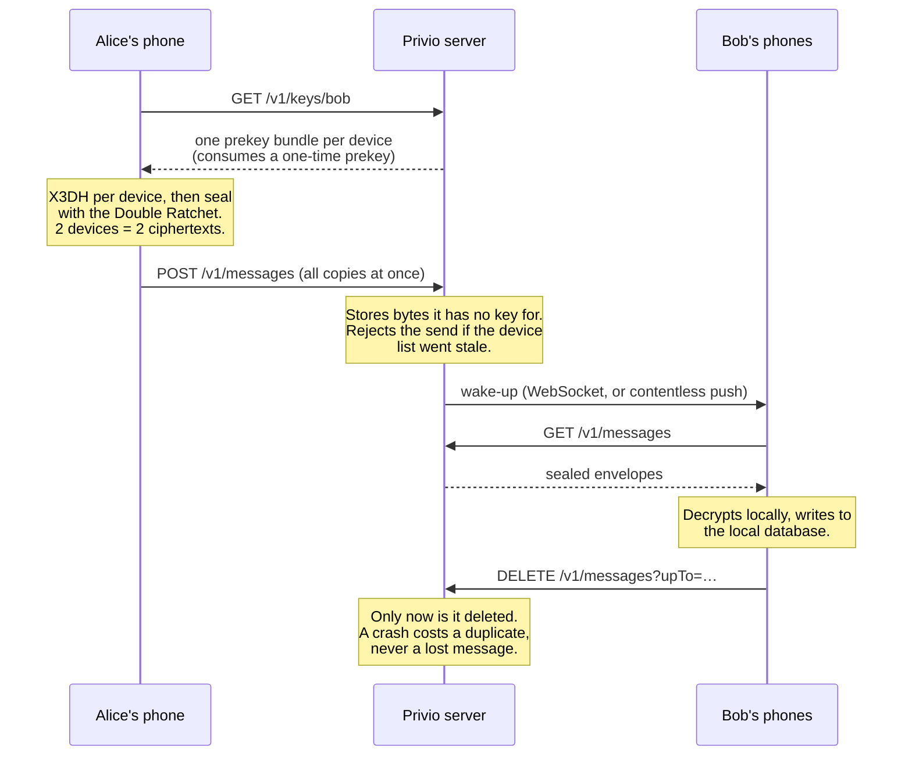

<div align="center">


### Encrypted. Private. Yours.

A privacy-first secure messenger for iOS and Android.


</div>

---

## The one rule

**The server never holds a key that can open a message.**

It routes sealed envelopes and stores ciphertext. Everything else — the design,
the API, the database schema — follows from that. Where a decision traded
convenience for keeping the server ignorant, that was deliberate.

No phone number. No email. No address-book upload. You are a username.

---

## The app

<table>
<tr>
<td align="center" width="25%"><br><sub><b>Welcome</b><br>What Privio promises, before anything is asked of you</sub></td>
<td align="center" width="25%"><br><sub><b>Chats</b><br>Search and filters run on-device</sub></td>
<td align="center" width="25%"><br><sub><b>Chat</b><br>Sealed before it leaves the phone</sub></td>
<td align="center" width="25%"><br><sub><b>Contacts</b><br>Usernames, not phone numbers</sub></td>
</tr>
<tr>
<td align="center"><br><sub><b>Account</b><br>Your identity, your storage, your keys</sub></td>
<td align="center"><br><sub><b>Invite</b><br>QR generated on-device</sub></td>
<td align="center"><br><sub><b>Settings</b><br>Everything in one place</sub></td>
<td align="center"><br><sub><b>Privacy &amp; Security</b><br>Every switch is enforced somewhere real</sub></td>
</tr>
<tr>
<td align="center"><br><sub><b>Devices</b><br>See what is logged in, log it out</sub></td>
<td align="center"><br><sub><b>Backup</b><br>Sealed with a key only you hold</sub></td>
<td align="center"><br><sub><b>Notifications</b><br>Push carries no content at all</sub></td>
<td align="center"><br><sub><b>Groups</b><br>The name is decrypted by members, never by the server</sub></td>
</tr>
</table>

<details>
<summary><b>More screens</b> — add contact, invite link, appearance, about</summary>
<br>
<table>
<tr>
<td align="center" width="25%"><br><sub><b>Add contact</b></sub></td>
<td align="center" width="25%"><br><sub><b>Invite link</b></sub></td>
<td align="center" width="25%"><br><sub><b>Appearance</b></sub></td>
<td align="center" width="25%"><br><sub><b>About</b></sub></td>
</tr>
</table>
</details>

> These are real screenshots of the running app, captured at 390×844, not mockups.

### It actually works

Two accounts, two devices, one real server. Clara adds Finn by username, sends a
message, Finn's client decrypts it, replies, and Clara's client decrypts the
reply — the Double Ratchet running in both directions.

<table>
<tr>
<td align="center" width="25%"><br><sub><b>1.</b> Clara sends. The server takes bytes it cannot read.</sub></td>
<td align="center" width="25%"><br><sub><b>2.</b> It arrives at Finn, who had never heard of Clara.</sub></td>
<td align="center" width="25%"><br><sub><b>3.</b> His reply comes back decrypted.</sub></td>
<td align="center" width="25%"><br><sub><b>4.</b> After a relaunch it is still there — read back from the encrypted archive, not re-fetched.</sub></td>
</tr>
</table>

That run found a real bug: the client was declaring a JSON content type on
requests with no body, which a strict server rejects — so the receive loop had
been failing silently every three seconds. It is fixed and covered by a test.

---

## What works today

| Area | Status | Detail |
| --- | :---: | --- |
| **Registration & login** | ✅ | Username + password. No phone number, no email |
| **End-to-end encryption** | ✅ | X3DH + Double Ratchet, one sealed copy per device |
| **Two-factor auth** | ✅ | TOTP (RFC 6238), enforced at login |
| **Wipe code** | ✅ | Duress code that destroys everything and looks like a typo |
| **Contacts & blocking** | ✅ | Exact-username lookup, invisible blocking |
| **Groups** | ✅ | Create, name (encrypted), send and receive — in the app |
| **Media** | ✅ | Client-encrypted attachments with enforced expiry |
| **Backup** | ✅ | Sealed with a recovery key the server never sees |
| **At-least-once delivery** | ✅ | Envelopes are acknowledged only after they decrypt |
| **Push notifications** | ✅ | Contentless wake-ups; APNs/FCM see no metadata |
| **Device management** | ✅ | List, remote logout, per-device sessions |
| **App lock** | ✅ | PIN and biometrics, re-locks on backgrounding |
| **Chat UI wired to crypto** | ✅ | Real accounts, real sends, real decryption |
| **Encrypted local history** | ✅ | AES-256-GCM under a key in the platform keystore |
| **Metadata stripped from files** | ✅ | GPS, camera, serial numbers, timestamps — automatically, no setting |
| **Attachments in the chat** | 🔧 | Send, receive and display work; the OS file dialog is untested (see below) |
| **Profile pictures** | 🔧 | Encrypted end to end; same untested file dialog |
| **Message length hidden** | ✅ | Padded into buckets, so size says nothing |
| **Realtime delivery** | ✅ | WebSocket push — measured at 722 ms end to end, not 3 s |
| **Voice & video calls** | 📋 | V2 — WebRTC over the existing Signal sessions |
| **Channels** | 🔧 | Server complete and tested; the app cannot see them yet |
| **Disguise mode** | 📋 | V2 — the calculator skin |

✅ done and tested · 🔧 in progress · 📋 planned

---

## How a message travels



---

## Architecture

```
 iOS / Android (Flutter)                     Server (Node.js + TypeScript)
 ┌──────────────────────────┐                ┌──────────────────────────────┐
 │ Screens · dark, minimal  │                │ Fastify HTTP + WebSocket     │
 │ Local encrypted database │                │                              │
 │ Signal Protocol session  │  sealed bytes  │ accounts · devices · keys    │
 │  · X3DH key agreement    │ ─────────────► │ envelopes · groups           │
 │  · Double Ratchet        │ ◄───────────── │ media · backups              │
 │ Keystore / Keychain      │   TLS 1.3      │                              │
 └──────────────────────────┘                └───────────┬──────────────────┘
                                                         │
                                         ┌───────────────┼───────────────┐
                                    PostgreSQL       Redis (opt.)   Blob storage
                                    routing +        fan-out across  ciphertext
                                    ciphertext       API instances   only
```

| Layer | Location | Responsibility |
| --- | --- | --- |
| Screens | `app/lib/screens/` | One file per screen in the design |
| Widgets | `app/lib/widgets/` | Rows, bubbles, avatars, the brand mark |
| Theme | `app/lib/theme/` | The measured design tokens |
| Messaging | `app/lib/services/` | The only place plaintext meets the transport |
| **Archive** | `app/lib/data/` | The decrypted history, sealed at rest |
| **Media** | `app/lib/media/` | Metadata scrubbing, per-file encryption, padding |
| **Crypto** | `app/lib/crypto/` | X3DH, the Double Ratchet, the key store |
| Transport | `app/lib/core/` | HTTP client, keystore, app state |
| API routes | `server/src/routes/` | Accounts, devices, contacts, messages, groups, media, backup |
| Delivery | `server/src/services/` | Queueing, fan-out, push wake-ups |
| Schema | `server/migrations/` | Every content column is a `bytea` the server cannot read |

There is no state-management package in the client. `InheritedNotifier` covers
what the app needs, and every dependency in a security product is a dependency
someone has to audit.

---

## What the server can and cannot see

| It can see | It cannot see |
| --- | --- |
| Usernames and account creation time | Message text, voice notes, media, files |
| Which accounts exchange envelopes, and when | Group names and avatars |
| Device counts, and a padded size bucket | How long a message actually is |
| Group membership | Contact names and aliases you set locally |
| That a file was uploaded, and roughly how big | File names, types, or anything inside them |
| Attachment lifetimes | Search queries — search never leaves the device |

**Push notifications carry nothing.** They say "something arrived" and no more —
not the sender, not a preview, not a count. The device wakes, connects and
decrypts locally, so Apple and Google see traffic, never content.

---

## Metadata

Encryption protects what you write. It does nothing about everything *around*
what you write — and that is often the part that identifies you.

**Files are stripped before they are sent.** A photo out of a phone carries GPS
coordinates, the camera make and model, a serial number and the second it was
taken. Encrypting it delivers all of that intact to the recipient. Privio removes
it on the way out, every time, with no setting to forget:

| Format | Removed |
| --- | --- |
| JPEG | EXIF and XMP (GPS, camera, serial number, timestamps), IPTC, ICC profile, comments |
| PNG | Text and comment chunks, embedded EXIF, modification time, ICC profile |
| MP4 / MOV | User-data boxes (GPS, device make and model), metadata tags, recording timestamps |

Only container structure is touched — the pixels and the audio are passed through
byte for byte, so nothing is re-encoded and nothing degrades. A format Privio
cannot clean is still sent, encrypted, but the app says so rather than letting
you assume otherwise.

**Message length is padded away.** Ciphertext length tracks plaintext length, and
the server sees every ciphertext. Unpadded, "yes" is distinguishable from a
paragraph. Every payload is padded into a doubling bucket before it is sealed, so
the server observes a handful of sizes instead of a continuum — and a text
message is indistinguishable from a photo being sent.

Attachments are padded the same way. Be precise about what that buys: for short
messages it is near-total, since everything under 256 bytes looks identical. For
a large file it means an observer learns the size only to within a factor of two,
which is a real improvement over the exact byte count but is not invisibility.

**Profile pictures are encrypted too.** A messenger that promises the server
cannot read anything, and then stores everyone's face in the clear, has not kept
the promise. An avatar is sealed with a long-lived *profile key* that reaches
contacts inside end-to-end encrypted messages and never reaches the server — so
the server holds a picture it cannot open, and only people you have actually
written to can see it. It is also re-encoded to 512×512 on the way out, which
strips metadata a second time and stops a full-resolution photo of your
surroundings from becoming your avatar.

**Channels are encrypted, public ones included — with a caveat worth stating.**
A post is sealed once under a channel key, so the server stores something it
cannot read, search or hand over. What that does *not* do is keep a public
channel secret from its own audience: if anyone may join, anyone may hold the
key. The key never passes through the server — it travels in the fragment of an
invite link, the part that is never transmitted, or from an admin over an
encrypted message — which is what stops the server from simply subscribing to
everything. A public channel's handle, title and description are plaintext,
because search cannot run over ciphertext; its posts are not.

**File names never leave the encrypted envelope.** `passport_scan.pdf` travels
inside the sealed message next to the key, never beside the upload.

---

## Cryptography

Privio writes **no cryptographic primitives of its own.** It composes audited
implementations of established protocols.

| Purpose | Choice |
| --- | --- |
| Message encryption | Signal Protocol — X3DH + Double Ratchet |
| Password hashing | Argon2id, 64 MiB, t=3, p=1 |
| Session tokens | 256-bit random, stored only as SHA-256 |
| Transport | TLS 1.3 |
| Attachments | AES-256-GCM, random key per file |
| Backups | AES-256-GCM under a key from your recovery phrase |
| Local history | AES-256-GCM under a key in the platform keystore |
| Profile pictures | AES-256-GCM under a profile key, shared only with contacts |
| Attachments | AES-256-GCM, a fresh random key per file, size padded |
| Two-factor | TOTP, RFC 6238 |

### The caveats, stated plainly

A privacy product that overstates itself is worse than one that says nothing.

1. **The protocol implementation is a port, not the audited original.** Messages
   are genuinely end-to-end encrypted, and the tests prove a third party holding
   the ciphertext cannot open it. But it runs on `libsignal_protocol_dart`, a
   pure-Dart port rather than the official audited Rust `libsignal`. Moving to
   the official library behind FFI is a **pre-launch requirement**.
2. **The local history is one sealed blob, not a database.** It is encrypted
   correctly, but rewritten whole on every change, so it will not scale to a
   long history. Moving it to SQLCipher is planned; the storage port exists so
   that swap touches one file.
3. **No sealed sender.** Envelopes name the sender, which the server uses for
   blocking and rate limiting.
4. **No independent audit.** Before any public release the crypto integration
   needs review by someone who did not write it.

The full list, with the reasoning, is in
[`docs/security-model.md`](docs/security-model.md#known-gaps-in-the-current-implementation).

---

## Quick start

### Server

Requirements: Node.js 22+, PostgreSQL 14+. Redis is optional — it is only needed
once a second API instance exists.

```bash
cd server
cp .env.example .env          # then edit DATABASE_URL
npm install
npm run migrate               # migrations also run automatically on boot
npm run dev                   # http://localhost:8080
```

```bash
curl http://localhost:8080/health
# {"status":"ok","version":"0.1.0"}
```

### App

Requirements: Flutter 3.22+.

```bash
cd app
flutter pub get
flutter run
```

### Tests

The server suite runs against a **real PostgreSQL database** — no mocks, because
the parts worth testing are the queries.

```bash
createdb privio_test
cd server && TEST_DATABASE_URL=postgres://you@localhost:5432/privio_test npm test
#  55 passing

cd app && flutter analyze && flutter test
#  103 passing
```

Among the things those tests assert:

- a third party holding the exact bytes the server stores **cannot** open them
- changing **one byte** of a message makes it undecryptable rather than wrong
- the same plaintext **never** produces the same ciphertext twice
- a used one-time prekey is **deleted**, so forward secrecy holds
- a **swapped identity key is refused on send** — the attack this all exists to stop
- the history at rest is **ciphertext** — not the messages, not even the contact names
- a different key **cannot** read that archive, and a tampered one is discarded
- a photo's **GPS, camera model and serial number** are gone from what the recipient receives
- an avatar on the server is **not a picture** — a stranger's key opens nothing
- a group's **name is ciphertext** to the server; only members with the key read it
- a **private channel** answers a stranger exactly as it answers about one that does not exist
- a deleted post's ciphertext is **overwritten**, not left waiting for a key
- a second group message **reuses the session** instead of draining prekeys
- "yes" and a full paragraph produce **exactly the same ciphertext length**
- a 40-byte, a 100-byte and a 200-byte file all **upload at the same size**
- a photo sent through the real send path arrives **stripped**, and the server's copy gives nothing away
- a session token in a socket URL is **redacted** before it reaches the logs
- a duress wipe is **indistinguishable** from a mistyped password
- blocking is **invisible** to the blocked sender

---

## API at a glance

| Endpoint | Purpose |
| --- | --- |
| `POST /v1/accounts` | Register a username and its first device |
| `POST /v1/sessions` | Log in, registering the calling device |
| `GET /v1/keys/:username` | One prekey bundle per device of that user |
| `POST /v1/keys/one-time` | Top up the published prekey pool |
| `POST /v1/messages` | Send one sealed copy per recipient device |
| `GET /v1/messages` | Drain this device's queue |
| `DELETE /v1/messages?upTo=` | Acknowledge, which deletes server-side |
| `GET /v1/ws` | Realtime delivery socket |
| `POST /v1/groups` | Create a group with encrypted metadata |
| `POST /v1/media` | Upload an already-encrypted attachment |
| `PUT /v1/backup` | Upload an already-encrypted backup |

Full route list in [`docs/architecture.md`](docs/architecture.md).

---

## Project layout

```
privio-messenger/
├── app/                    Flutter client (iOS + Android)
│   ├── lib/crypto/           X3DH, Double Ratchet, key store, padding
│   ├── lib/media/            Metadata scrubbing and attachment encryption
│   ├── lib/services/         Messaging: the plaintext boundary
│   ├── lib/screens/          One file per screen
│   ├── lib/widgets/          Shared components
│   ├── lib/theme/            Design tokens
│   └── test/                 22 tests, incl. the crypto round trip
├── server/                 Node.js + TypeScript API
│   ├── src/routes/           HTTP endpoints
│   ├── src/services/         Delivery, storage, sessions
│   ├── migrations/           SQL schema
│   └── test/                 35 tests against real PostgreSQL
├── design/                 Brand assets and the source mockups
└── docs/                   Architecture, security model, design system
```

---

## Design

Dark-first, because it is the brand and because true black costs nothing on the
OLED panels most phones ship with.

| Token | Value | Use |
| --- | --- | --- |
| `accent` | `#22C55E` | Primary actions, active tab, read ticks, online dots |
| `background` | `#000000` | App background |
| `surface` | `#0B0B0B` | Cards and list rows |
| `bubbleOutgoing` | `#0B3B21` | Your messages |
| `danger` | `#EF4444` | Wipe code, missed calls, destructive actions |

The full system — typography, spacing, every screen and component — is in
[`docs/design-system.md`](docs/design-system.md), measured from the mockups in
`design/mockups/`.

---

## Roadmap

**V1** — Authentication · Accounts · Contacts · E2EE 1:1 messaging · Groups ·
Media · Notifications · Backup

**V2** — Channels · Voice and video calls · Multi-device · Advanced privacy ·
Disguise mode · Wipe code

---

## Contributing rules that are not negotiable

1. **No custom cryptography.** Use audited implementations of established
   protocols. If you find yourself writing a cipher, stop.
2. **No plaintext to the server.** If a new field could carry user content, it
   is a `bytea` the server cannot interpret.
3. **Say what is not done.** An overstated privacy claim is worse than a missing
   feature.

---

## Documentation

| Document | What it covers |
| --- | --- |
| [Architecture](docs/architecture.md) | How the pieces fit, and how a message travels |
| [Security model](docs/security-model.md) | What is protected, what is not, and what is still missing |
| [Design system](docs/design-system.md) | Colours, typography, every screen and component |

<div align="center">
<br>
<sub>Built with privacy in mind. No tracking. No ads. Just you.</sub>
</div>
